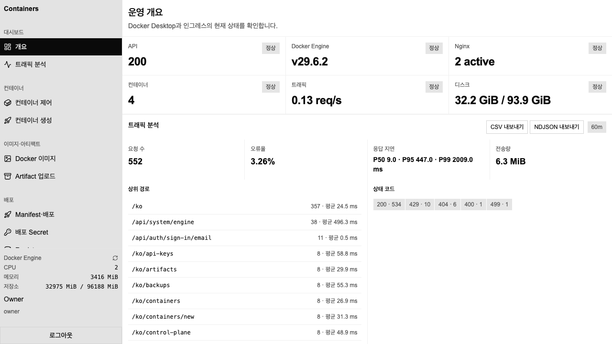

# Containers

A self-hosted Docker management panel that runs entirely on your own machine — a modern alternative to Portainer / Yacht for a single Docker host, hardened as if it were a production control plane.



It lets you control Docker containers, create and deploy them, inspect live traffic, and manage the Nginx reverse proxy (including a GUI config editor) — all through a single web panel on your own machine. It ships with role-based access control, encrypted credentials, automated backups, and rate limiting, so it behaves like a small production control plane rather than an admin toy.

## Requirements

- macOS (Apple Silicon, Docker Desktop) or Linux (rootful Docker Engine)
- Docker Compose v2.24+ (the `!override` merge tag is used by `compose.override.yaml`)
- On Linux: a `/var/run/docker.sock` unix socket — the setup script reads its group id and pins `engine-agent` to it via `group_add`. Rootless Docker is not supported (different socket path).
- [Bun](https://bun.sh) (for local development only — runtime uses Docker images)

## Run it

The recommended way is the interactive setup script (macOS and Linux):

```bash
./scripts/setup.sh
```

It checks the environment, detects the docker socket group id on Linux, verifies the Compose file, optionally builds, starts the stack, and runs a smoke test — including a sign-in call with a real `Origin` header so a mismatched public origin fails here instead of at first login. It creates a `compose.override.yaml` for customization (panel bind address/port, public origin, backup interval/retention, traffic retention).

To run manually:

```bash
docker compose build
docker compose up -d --wait
```

Then open **http://127.0.0.1:8080**. On first boot, bootstrap the owner account from the panel.

Customization goes in `compose.override.yaml`. The defaults below come from `compose.yaml`; the values in parentheses are the compose interpolation variables you can also export in your shell.

| Setting                   | Service          | Key                                                         | Default          |
| ------------------------- | ---------------- | ----------------------------------------------------------- | ---------------- |
| Panel bind address / port | `nginx`          | `ports` (`PANEL_BIND_ADDRESS`, `PANEL_PORT`)                | `127.0.0.1:8080` |
| Panel public origin       | `api`            | `AUTH_BASE_URL`, `PANEL_PUBLIC_URL` (`PANEL_PUBLIC_ORIGIN`) | panel bind URL   |
| Trusted auth origins      | `api`            | `AUTH_TRUSTED_ORIGINS`, comma separated                     | panel bind URL   |
| Docker socket group id    | `engine-agent`   | `group_add` (`DOCKER_GID`)                                  | `0`              |
| Automatic backup interval | `api`            | `BACKUP_INTERVAL_HOURS`                                     | `24`             |
| Backups kept              | `api`            | `BACKUP_RETENTION_COUNT`                                    | `7`              |
| Raw traffic log retention | `traffic-worker` | `TRAFFIC_RAW_RETENTION_DAYS`                                | `14`             |

If you change the panel port, host, or scheme, change the public origin **and** the trusted origin list together — otherwise the stack comes up healthy and every sign-in fails with `403 INVALID_ORIGIN`. Serving the panel over HTTPS automatically switches session cookies to `Secure`, so an HTTPS public origin behind an HTTP-only edge will not keep a session.

## Development

```bash
bun install
bun run dev        # run all workspaces
bun run typecheck  # typecheck all workspaces
bun run lint
bun test           # unit + integration tests
bun run build
```

## Project layout

```
apps/
  api/            Hono control-plane API + DB + auth
  engine-agent/   Docker Engine API client, exec, streams, nginx apply
  traffic-worker/ access-log ingestion, analytics, export
  web/            Next.js panel
packages/
  contracts/      shared Zod schemas / RPC types
  db-schema/      Drizzle schema + migrations
  config/         env + trusted origin + secret loading
infra/nginx/      edge nginx (rate limits, security headers)
```

## For AI

Coding agents should read **`docs/llm.txt`** first — it is a single, self-contained
reference of the architecture, every API endpoint, the SQLite schema, the auth
and security model, and the deployment pipeline, tuned for LLM consumption.

- `docs/llm.txt` — full AI-ready project reference (endpoints, DB, security, flows)
- `docs/ci-examples/` — ready-to-drop CI workflows:
    - `github-actions.yml` — `.github/workflows/ci.yml`
    - `gitea-actions.yml` — `.gitea/workflows/ci.yml`
    - `gitlab-ci.yml` — `.gitlab-ci.yml`
- `docs/README.md` — human-facing documentation index

Human-facing documentation lives in [`docs/`](docs/README.md).
