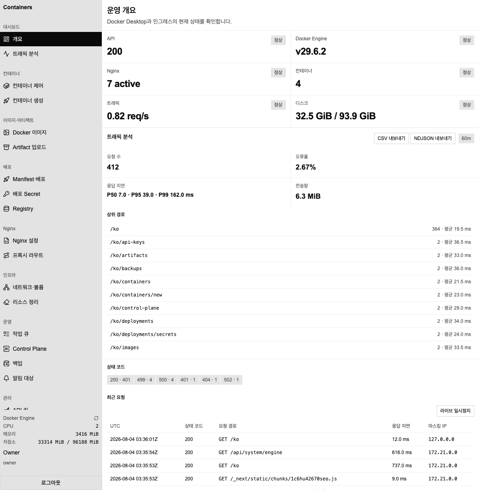
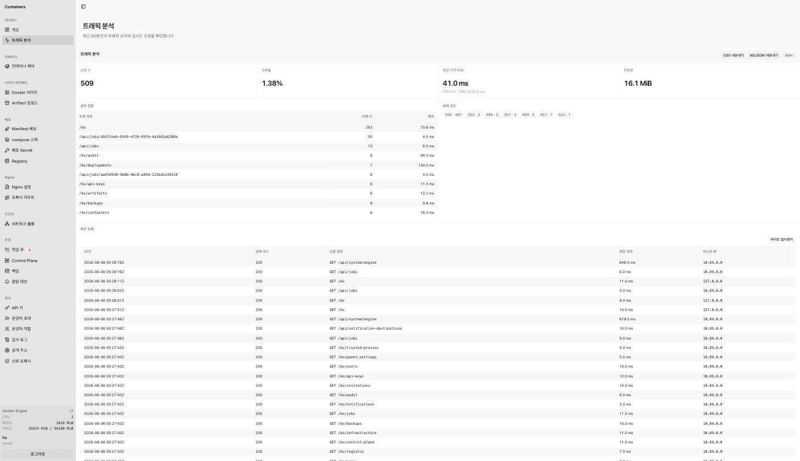
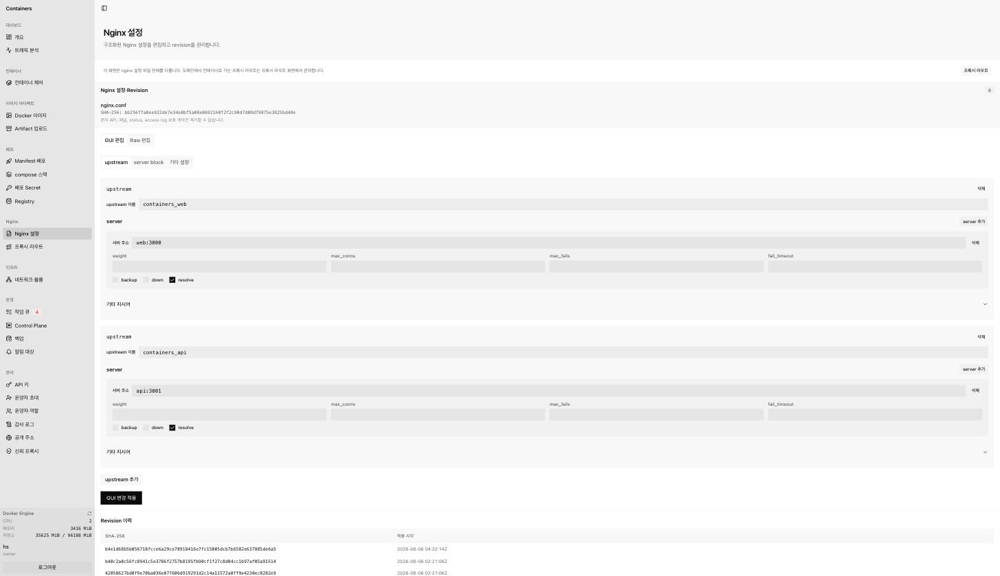
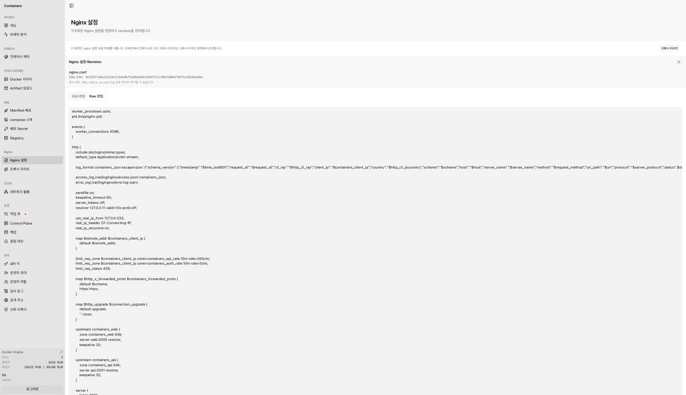
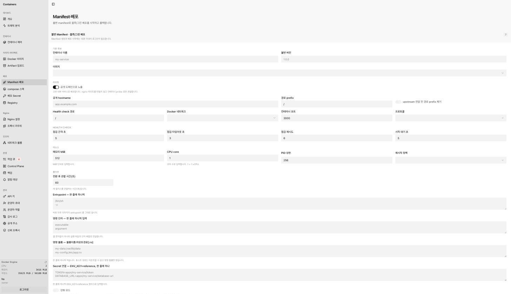
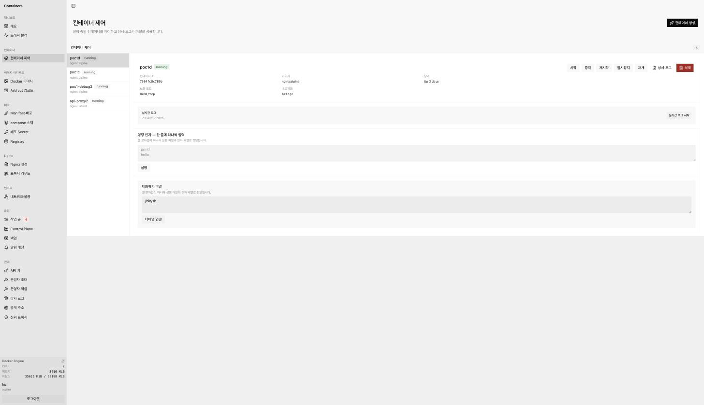

# Containers

A self-hosted Docker management panel that runs entirely on your own machine — a modern alternative to Portainer / Yacht for a single Docker host, hardened as if it were a production control plane.


It lets you control Docker containers, create and deploy them, inspect live traffic, and manage the Nginx reverse proxy (including a GUI config editor) — all through a single web panel on your own machine. It ships with role-based access control, encrypted credentials, automated backups, and rate limiting, so it behaves like a small production control plane rather than an admin toy.

Everything the panel can do is also scriptable: the whole control surface — containers, images, networks, volumes, nginx routes, deployments, backups, traffic, audit — is exposed through scoped API keys (per-domain read/write scopes, owner-only for the sensitive ones), so CI and scripts automate the same operations end to end. Only interactive exec, API-key management, and account flows stay session-only.

<details>
<summary>More screens</summary>

|                                                                                        |                                                                                   |
| -------------------------------------------------------------------------------------- | --------------------------------------------------------------------------------- |
|  Operations overview                         |  Traffic analytics with live tail           |
|  Nginx GUI config editor              |  Raw config with revisions           |
|  Immutable manifest / blue-green release |  Container control with logs and exec |

</details>

## Requirements

- **macOS (Apple Silicon, Docker Desktop)** — the supported and verified platform
- Docker Compose v2.24+ (the `!override` merge tag is used by `compose.override.yaml`)
- [Bun](https://bun.sh) (for local development only — runtime uses Docker images)

> **Linux is implemented but not verified.** `scripts/setup.sh` detects the `/var/run/docker.sock` group id and pins `engine-agent` to it via `group_add`, and nothing in the stack is macOS-specific — but it has never been run on a Linux host, so treat it as untested. Rootless Docker is not supported either way (different socket path). Reports welcome.

## Run it

The recommended way is the interactive setup script:

```bash
./scripts/setup.sh
```

It checks the environment, detects the docker socket group id (Linux), verifies the Compose file, compares the declared network subnets against the ones Docker actually created, optionally builds, starts the stack, and runs a smoke test — including a sign-in call with a real `Origin` header so a mismatched public origin fails here instead of at first login. It creates a `compose.override.yaml` for customization (panel bind address/port, public origin, backup interval/retention, traffic retention).

For CI and unattended provisioning it also runs without prompts. Non-interactive mode is implied when stdin is not a TTY, and every prompt falls back to a flag or an environment variable of the same name (`scripts/setup.sh --help` lists them):

```bash
./scripts/setup.sh --non-interactive --write-override \
    --port 9090 --public-origin https://panel.example.com \
    --start-mode build
```

Exposing the panel on a domain? Run the tunnel or reverse proxy however you like — the stack never holds its token. Point it at the published port, then approve the proxy address and the public origin from the panel itself: both screens list what actually hit the access log, so you pick from observed values instead of typing them. See [`docs/EXPOSURE.md`](docs/EXPOSURE.md) §2.

Two things bite people here. A wildcard record (`*.example.com`) does **not** cover the apex (`example.com`) — the apex needs its own hostname or DNS record, otherwise it fails DNS resolution while every subdomain works. And whichever hostname you give the panel becomes a _protected_ hostname, so you cannot later point it at a workload container. Put the panel on a subdomain and leave the apex free if you want to serve something else from it.

`--start-mode` picks `build` (build then start, the default), `up` (start without building) or `skip` (checks only). An existing `compose.override.yaml` is kept as is unless you pass `--replace-override`, which backs it up to `compose.override.yaml.bak` first.

To run manually:

```bash
docker compose build
docker compose up -d --wait
```

Then open **http://127.0.0.1:18080**. On first boot, bootstrap the owner account from the panel.

Customization goes in `compose.override.yaml`. Most defaults below come from `compose.yaml`; the values in parentheses are the compose interpolation variables you can also export in your shell. Rows marked **override only** are read by the service's own env schema but are not declared in `compose.yaml`, so exporting them in your shell does not reach the container — set them in `compose.override.yaml`.

| Setting                   | Service          | Key                                                         | Default           |
| ------------------------- | ---------------- | ----------------------------------------------------------- | ----------------- |
| Panel bind address / port | `nginx`          | `ports` (`PANEL_BIND_ADDRESS`, `PANEL_PORT`)                | `127.0.0.1:18080` |
| Panel public origin       | `api`            | `AUTH_BASE_URL`, `PANEL_PUBLIC_URL` (`PANEL_PUBLIC_ORIGIN`) | panel bind URL    |
| Trusted auth origins      | `api`            | `AUTH_TRUSTED_ORIGINS`, comma separated                     | panel bind URL    |
| Docker socket group id    | `engine-agent`   | `group_add` (`DOCKER_GID`)                                  | `0`               |
| Automatic backup interval | `api`            | `BACKUP_INTERVAL_HOURS` (override only)                     | `24`              |
| Backups kept              | `api`            | `BACKUP_RETENTION_COUNT` (override only)                    | `7`               |
| Raw traffic log retention | `traffic-worker` | `TRAFFIC_RAW_RETENTION_DAYS`                                | `14`              |
| Traffic row cap           | `traffic-worker` | `TRAFFIC_MAX_EVENT_ROWS`                                    | `2000000`         |
| Traffic DB size cap       | `traffic-worker` | `TRAFFIC_MAX_DB_BYTES`                                      | `1073741824`      |
| Traffic cleanup interval  | `traffic-worker` | `TRAFFIC_RETENTION_INTERVAL_SECONDS`                        | `60`              |
| Artifact retention days   | `api`            | `ARTIFACT_RETENTION_DAYS`                                   | `30`              |
| Artifacts always kept     | `api`            | `ARTIFACT_RETENTION_MINIMUM_COUNT`                          | `5`               |
| Upload storage quota      | `api`            | `UPLOAD_TOTAL_QUOTA_BYTES` (override only)                  | `34359738368`     |
| Audit retention days      | `api`            | `AUDIT_RETENTION_DAYS`                                      | `365`             |
| Nginx revisions kept      | `engine-agent`   | `NGINX_REVISION_KEEP_COUNT`                                 | `20`              |

If you change the panel port, host, or scheme, change the public origin **and** the trusted origin list together — otherwise the stack comes up healthy and every sign-in fails with `403 INVALID_ORIGIN`. Serving the panel over HTTPS automatically switches session cookies to `Secure`, so an HTTPS public origin behind an HTTP-only edge will not keep a session.

## Upgrading

```bash
git pull --ff-only
./scripts/migration-dry-run.sh   # snapshot volumes first if migrations are pending
docker compose build
docker compose up -d --wait
```

Two failure modes are worth knowing before you need them, because neither shows up in `docker compose logs`:

- **A release that changes network or volume definitions can stop `up` entirely.** Compose cannot edit an existing network in place, so it tries to recreate it and fails while other services are still attached (`network ... has active endpoints`). Bring the stack down with `docker compose down` — without `-v`, so volumes survive — and start it again.
- **The managed nginx config does not follow the image.** Its source of truth is the `nginx-config` volume, not `infra/nginx/nginx.conf`, and the entrypoint only seeds it when the file is absent. A config from an older release keeps running until something that validates it — saving a proxy route, for instance — fails with a `409` that names none of this.

Full procedure, readiness checks, volume snapshots, and rollback: [`docs/CONTROL-PLANE-UPGRADE.md`](docs/CONTROL-PLANE-UPGRADE.md). Incident playbooks: [`docs/RUNBOOK.md`](docs/RUNBOOK.md).

## Development

```bash
bun install
bun run dev        # run all workspaces
bun run typecheck  # typecheck all workspaces
bun run lint
bun run test       # unit + integration tests (backend + web)
bun run build
```

## Project layout

```
apps/
  api/            Hono control-plane API + DB + auth
  egress-broker/  DNS resolution + webhook delivery broker (only egress holder)
  engine-agent/   Docker Engine API client, exec, streams, nginx apply
  traffic-worker/ access-log ingestion, analytics, export
  web/            Next.js panel
packages/
  contracts/      shared Zod schemas / RPC types
  db-schema/      Drizzle schema + migrations
  config/         env + trusted origin + secret loading
  nginx-config/   nginx tokenizer/serializer (GUI editor + protected contract)
infra/nginx/      edge nginx (rate limits, security headers)
```

## For AI

Coding agents should read **`docs/llm.txt`** first — it is a single, self-contained
reference of the architecture, every API endpoint, the SQLite schema, the auth
and security model, and the deployment pipeline, tuned for LLM consumption.

- `docs/llm.txt` — full AI-ready project reference (endpoints, DB, security, flows)
- `docs/ci-examples/` — ready-to-drop CI files:
    - Build CI: `github-actions.yml` (`.github/workflows/ci.yml`, typecheck · lint · test · build),
      `gitea-actions.yml`, `gitlab-ci.yml`
    - `containers-deploy.sh` — the deploy driver. One script holds the call order and the
      success verdict: `deploy` (upload → image load → manifest → blue-green release),
      `stack` (compose preview → register → stack release) and `rollback`. Copy it into your
      repository (e.g. `ci/containers-deploy.sh`); its call sequence is covered by
      `containers-deploy.test.ts` against a stub server.
    - `github-actions-deploy.yml`, `gitea-actions-deploy.yml`, `gitlab-ci-deploy.yml` — thin
      wrappers that call that script, so the three CI systems cannot drift apart.
      The runner must be able to reach the panel, so use a self-hosted runner on the same
      host or expose the API over HTTPS through a tunnel. API keys expire in at most 365 days.
      Automation beyond this script is a curl away — see the scope-per-route table in
      [`docs/API-DATA-AUTH.md`](docs/API-DATA-AUTH.md).
- `docs/README.md` — human-facing documentation index

Human-facing documentation lives in [`docs/`](docs/README.md).
