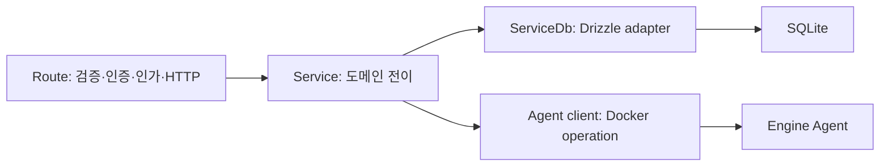

# API, 데이터, 인증 지시서

## 1. Hono 계층

- Route는 `createXxxRoute(deps)` factory이며 Hono 인스턴스를 반환한다.
- 모든 JSON·query·param은 Zod validator를 사용한다.
- 모든 handler는 `withErrorHandling` 바깥, `withAuth`·`withCapability` 안쪽 순으로 합성한다.
- Service는 Hono Context와 Drizzle을 받지 않는다.
- DB query와 transaction은 compose의 `*ServiceDb` 구현에만 둔다.
- Agent client는 Service dependency이며 Docker SDK type을 도메인에 누출하지 않는다.
- 모든 응답은 success, paginated, error helper를 사용한다.

## 2. API 그룹

동일 Hono route 계약을 두 ingress profile로 노출한다.

- 패널 profile: `panel.<domain>`의 `/api/*`, Cloudflare Access와 session cookie, auth·invite UI 포함
- 외부 profile: `api.<domain>`의 `/api/*`, 애플리케이션 API 키만 허용, session·auth route 제외

middleware는 Host 문자열만 신뢰하지 않고 Nginx가 내부 network에서 서명해 전달한 ingress profile을 검증한다.

| prefix                 | 주요 기능                                                       |
| ---------------------- | --------------------------------------------------------------- |
| `/api/auth/*`          | Better Auth handler                                             |
| `/api/session`         | 현재 사용자와 capability                                        |
| `/api/dashboard/*`     | overview, engine health, jobs summary                           |
| `/api/containers/*`    | list, detail, lifecycle, exec ticket, logs, stats, archive      |
| `/api/images/*`        | list, inspect, pull, tag, remove, load 연결                     |
| `/api/networks/*`      | list, inspect, create, connect, disconnect, remove              |
| `/api/volumes/*`       | list, inspect, create, remove                                   |
| `/api/nginx/*`         | status, routes, revisions, validate, apply, rollback, error log |
| `/api/traffic/*`       | overview, series, top, slow, errors, live, export               |
| `/api/uploads/*`       | upload session, chunks, 검사 결과                               |
| `/api/deployments/*`   | create, detail, versions, rollback                              |
| `/api/jobs/*`          | 상태, cancel, SSE events                                        |
| `/api/bootstrap/*`     | 최초 owner 생성 여부, 최초 owner 생성 (로컬 주소 전용)          |
| `/api/users/*`         | invite, role, disable, delete                                   |
| `/api/panel-settings`  | 공개 주소·추가 신뢰 origin, 접근 시도된 host 후보               |
| `/api/trusted-proxies` | 앞단 프록시 승인·해제, 관측된 source 주소 후보                  |
| `/api/api-keys/*`      | create, list metadata, revoke, rotate                           |
| `/api/audit/*`         | filter, detail, export                                          |
| `/api/backups/*`       | local control·traffic backup list, create, restore, remove      |
| `/api/system/*`        | engine info, disk usage, backups, maintenance                   |
| `/ws/exec/:ticket`     | TTY stream                                                      |
| `/events/docker`       | Docker event SSE                                                |

### 2.1 인증 방식 (구현 기준)

아래 표는 **현재 코드가 실제로 받아들이는 인증 방식**이다. 위 prefix 표는 목표 그룹핑이라 일부 경로명이 다르다.

인증은 세 층이다.

- **session**: Better Auth 세션 쿠키 + `user_role` 역할 검사(`requireRole`).
- **recent session**: 위와 같되 세션이 최근 15분 안에 인증돼야 한다(`requireRecentRole`). 파괴적·보안 민감 조작에만 요구한다.
- **bootstrap**: 계정이 하나도 없을 때 최초 owner 를 만드는 인증 없는 경로다. 그래서 공개 주소에서는 `BOOTSTRAP_ORIGIN_FORBIDDEN`(403)으로 거부하고, 공개 주소가 설정되기 전부터 존재하는 이름(`127.0.0.1`·`localhost`·`::1`·`panel.containers.local`·`api.containers.local`)에서만 받는다. 이후 사용자는 초대로만 늘어난다. seed 계정은 없다.
- **API key**: `authorization: Bearer ctk_...`. `Authorization` 헤더가 있으면 route가 API key 경로로 분기하고, 없으면 세션 경로로 간다. 키는 sha256 해시로만 저장되며 scope·만료·분당 rate limit(`API_KEY_RATE_LIMIT_PER_MINUTE`, 기본 120)을 적용한다. `backup:write`·`secret:write`는 **발급·사용 모두 owner에게만** 허용된다.

| 경로                                                                                                                                                                 | API key scope               | session 요구                              |
| -------------------------------------------------------------------------------------------------------------------------------------------------------------------- | --------------------------- | ----------------------------------------- |
| `GET /api/health`                                                                                                                                                    | 불필요                      | 불필요                                    |
| `GET /api/readyz`                                                                                                                                                    | `control-plane:read` (상세) | 요약은 불필요, 상세는 owner·admin         |
| `GET /api/artifacts`                                                                                                                                                 | `artifact:read`             | 전 역할                                   |
| `DELETE /api/artifacts/:artifactId`                                                                                                                                  | 불가                        | recent owner·admin                        |
| `POST /api/uploads/sessions`, `PUT .../chunks`, `POST .../finalize`                                                                                                  | `artifact:upload`           | owner·admin·operator                      |
| `POST /api/artifacts/:artifactId/load`                                                                                                                               | `image:load`                | recent owner·admin                        |
| `GET /api/deployment-manifests`, `GET /api/deployment-releases`(+ `/:id`)                                                                                            | `deployment:read`           | 전 역할                                   |
| `POST /api/deployment-manifests`                                                                                                                                     | `deployment:write`          | recent owner·admin                        |
| `POST /api/deployment-manifests/:manifestId/releases`                                                                                                                | `deployment:write`          | recent owner·admin                        |
| `GET /api/deployment-stacks`(+ `/:id`)                                                                                                                               | `deployment:read`           | 전 역할                                   |
| `POST /api/deployment-stacks/preview`, `POST /api/deployment-stacks`                                                                                                 | `deployment:write`          | recent owner·admin                        |
| `GET /api/deployment-stack-releases`(+ `/:id`)                                                                                                                       | `deployment:read`           | 전 역할                                   |
| `POST /api/deployment-stacks/:stackId/releases`                                                                                                                      | `deployment:write`          | recent owner·admin                        |
| `POST /api/deployment-releases/:id/rollback`                                                                                                                         | `deployment:write`          | recent owner·admin                        |
| `GET /api/deployment-secrets`                                                                                                                                        | `secret:read`               | owner·admin                               |
| `POST`·`DELETE /api/deployment-secrets`                                                                                                                              | `secret:write`(owner)       | recent owner·admin                        |
| `GET /api/deployment-secrets/key-versions` / `POST /api/deployment-secrets/rotate`                                                                                   | 불가                        | owner·admin / recent owner                |
| `GET /api/jobs`, `/api/jobs/:id`, `/api/jobs/:id/events`, `/api/jobs/backup-schedule`                                                                                | `job:read`                  | owner·admin                               |
| `POST /api/jobs/:id/cancel`                                                                                                                                          | `job:write`                 | recent owner·admin                        |
| `GET /api/backups`                                                                                                                                                   | `backup:read`               | owner                                     |
| `POST /api/backups`                                                                                                                                                  | `backup:write`(owner)       | recent owner                              |
| `POST /api/backups/:id/restore`, `DELETE /api/backups/:id`                                                                                                           | 불가                        | recent owner만                            |
| `GET /api/system/engine`, `/api/containers`, `/api/containers/:id`, `/api/containers/:id/logs`, `/api/images`                                                        | `engine:read`               | 전 역할                                   |
| `GET /api/control-plane/status`                                                                                                                                      | `control-plane:read`        | owner·admin                               |
| `/api/nginx/*` 조회                                                                                                                                                  | 불가                        | 전 역할                                   |
| `/api/nginx/*` 변경(`config/apply`, routes CUD)                                                                                                                      | 불가                        | recent owner·admin                        |
| `/api/traffic/*`                                                                                                                                                     | 불가                        | 전 역할(export·health는 owner·admin)      |
| `/api/audit`                                                                                                                                                         | 불가                        | owner·admin·viewer·auditor                |
| `/api/api-keys` 조회                                                                                                                                                 | 불가                        | owner·admin                               |
| `/api/api-keys` 생성·폐기                                                                                                                                            | 불가                        | recent 세션(폐기는 recent owner·admin)    |
| `/api/maintenance` 조회 / 변경                                                                                                                                       | 불가                        | 전 역할 / recent owner                    |
| `/api/notification-destinations`                                                                                                                                     | 불가                        | owner·admin                               |
| Docker 제어(`/api/containers` 생성·actions·exec, `/api/images/*`(목록 제외), `/api/networks/*`, `/api/volumes/*`, `/api/system/prune*`, `/api/registry-credentials`) | 불가                        | 조회는 전 역할, 변경은 recent owner·admin |
| SSE·exec stream(`/api/stream/*`, `/api/containers/:id/exec-tickets`, `/api/exec/ws/:ticket`)                                                                         | 불가                        | 전 역할                                   |
| `/api/auth/*`, `/api/session`, `/api/users`, `/api/invitations`                                                                                                      | 불가                        | Better Auth 세션                          |
| `GET /api/bootstrap/status`                                                                                                                                          | 불가                        | 불필요                                    |
| `POST /api/bootstrap/owner`                                                                                                                                          | 불가                        | 불필요, 단 로컬 주소에서만                |
| `PATCH`·`DELETE /api/users/:id`                                                                                                                                      | 불가                        | recent owner                              |
| `GET /api/panel-settings` / `PUT`                                                                                                                                    | 불가                        | owner·admin / recent owner                |
| `GET /api/trusted-proxies` / `POST`·`DELETE`                                                                                                                         | 불가                        | owner·admin / recent owner                |

CI·자동화가 배포 전 구간을 무인으로 수행하려면 `artifact:upload`, `image:load`, `deployment:read`, `deployment:write`, `job:read`가 필요하고, 배포 후 검증까지 하려면 `engine:read`·`control-plane:read`를, 교착 job 해소까지 하려면 `job:write`를 추가한다. 실제 워크플로는 [ci-examples/github-actions-deploy.yml](./ci-examples/github-actions-deploy.yml)에 있다.

## 3. 응답과 오류

성공 응답은 `{ success: true, data }`, 페이지 응답은 `{ success: true, data, pagination }`, 실패는 `{ success: false, error: { code, message, requestId, details? } }`다. production에서 내부 stack과 raw Engine payload를 details에 넣지 않는다.

오류 코드는 도메인 접두사를 사용한다.

- `AUTH_*`, `CAPABILITY_*`, `RATE_LIMITED`
- `DOCKER_*`, `CONTAINER_*`, `IMAGE_*`, `NETWORK_*`, `VOLUME_*`
- `NGINX_*`(대상 검증 실패는 `NGINX_ROUTE_TARGET_NOT_FOUND`·`NGINX_ROUTE_TARGET_UNREACHABLE`, 둘 다 400), `TRAFFIC_*`
- `UPLOAD_*`, `DEPLOYMENT_*`, `BACKUP_*`, `JOB_*`
- `VALIDATION_ERROR`, `CONFLICT`, `INTERNAL_ERROR`

### 3.1 세션 응답과 쿠키

`GET /api/session` 은 `expiresAt`·`role`·`user(id/email/name)` 만 돌려준다. 세션 토큰은 HttpOnly 쿠키에만 있고 응답 본문에 담지 않는다.

Better Auth 는 쿠키의 `Secure` 여부를 인스턴스 생성 시 한 번 정한다. loopback http 와 공개 https 를 동시에 지원할 수 없으므로 `useSecureCookies` 를 끄고, 응답 미들웨어가 `x-forwarded-proto` 가 https 인 요청에만 `Secure` 를 덧붙인다. 쿠키 **이름은 바꾸지 않아** 기존 세션이 끊기지 않는다. Nginx 는 그 헤더를 `$scheme` 이 아니라 앞단 프록시가 보낸 값에서 유도한다(TLS 는 Nginx 앞에서 끝난다).

사용자 id 는 UUID 가 아니다. Better Auth 가 sign-up 으로 만든 계정은 자체 형식 id 를 쓰므로 `:id` 는 빈 값만 거르는 문자열이다.

자기 자신의 계정은 변경·삭제할 수 없다(`SELF_MODIFICATION_FORBIDDEN`). 그 외에는 다른 owner 도 강등·비활성화·삭제할 수 있어 자격증명을 잃어도 대응 경로가 있고, 마지막 owner 는 아무도 대신 조작할 수 없어 그대로 남는다.

장시간 operation은 즉시 `202`와 job을 반환한다. 동기 endpoint timeout을 길게 늘려 pull, load, build, prune, export, deployment를 기다리지 않는다.

## 4. idempotency와 concurrency

- create, upload complete, deployment, destructive bulk operation은 `Idempotency-Key`를 요구한다.
- 동일 actor·route·key·body digest는 기존 결과를 반환한다.
- body가 다른 key 재사용은 conflict다.
- Nginx revision apply와 resource update는 expected version 또는 checksum을 요구한다.
- container action 직전에 inspect하고 expected state가 다르면 conflict와 현재 상태를 반환한다.
- 같은 target의 상충 job은 `operation_job.resource_key` 기반 active job 단일화(`enqueue uniqueResourceKey`)로 직렬화한다.

## 5. control DB schema

### 5.1 인증

- Better Auth core: user, session, account, verification
- `user_role`: userId, role, createdAt
- API key plugin tables와 permission metadata
- `invitation`: tokenHash, email, role, createdBy, expiresAt, acceptedAt, revokedAt

### 5.2 Docker metadata

- `docker_target`: id, name, endpointType, status, engineVersion, apiVersion, lastSeenAt
- `resource_metadata`: targetId, resourceType, resourceId, displayName, managed, labels, lastSeenAt
- `resource_snapshot`: targetId, resourceType, resourceId, observedAt, normalizedJson, stateHash

snapshot은 짧게 보존하고 현재 판단에 사용하지 않는다.

### 5.3 Nginx

- `nginx_route`: stable route identity와 desired fields. `managedBy` 는 이 라우트를 만든 `deployment_manifest` id 이고 패널이 만들면 `null` 이다(수정해도 유지된다). 수정은 `PUT /api/nginx/routes/:id`
- `nginx_revision`: revision, parent, status, renderedChecksum, author, createdAt
- `nginx_revision_file`: revisionId, relativePath, content, contentChecksum
- `nginx_apply`: revisionId, previousRevisionId, status, validationOutput, probeOutput, startedAt, finishedAt

### 5.4 upload·deployment·job

- `upload`: type, originalName, byteSize, digest, state, owner, expiresAt
- `upload_chunk`: uploadId, index, byteSize, digest, receivedAt
- chunk 본문은 요청 스트림을 그대로 파일 offset 에 이어 쓰고 sha256 을 증분 계산한다. 최대 64 MiB chunk 를 통째로 메모리에 올리지 않으며, digest 가 어긋나면 `receivedBytes` 를 전진시키지 않아 같은 offset 재전송이 덮어쓴다. finalize 가 파일 전체 sha256 을 다시 검증하므로 실패한 chunk 의 잔여 바이트는 결과에 영향을 주지 않는다.
- `artifact_scan`: uploadId, scanner, policyVersion, result, findingsSummary
- `deployment`: name, currentVersionId, routeId, status
- `deployment_version`: deploymentId, artifactId, imageDigest, containerId, manifestJson, status
- 현재 `operation_job`: id, kind, status, payload, result, resourceKey, failureCode, attempt, maxAttempts, progressStep, createdBy, scheduledAt, startedAt, heartbeatAt, cancelRequestedAt, finishedAt, createdAt, updatedAt
- 현재 `operation_job_event`: id, jobId, event, detail, createdAt
- `detail` 은 자유 JSON 객체다. `event: 'progress'` 중 `detail.step === 'failure-diagnostics'` 인 항목은 배포 실패 진단이며 `deploymentFailureDiagnosticsSchema`(contracts `deployment`)로 파싱된다 — exit code, container error, 리댁션한 로그 20줄. 저장 정책은 `SECURITY.md` §19.
- resource lock은 `operation_job.resource_key`와 `(kind, resource_key)` index로 제공한다. enqueue가 같은 kind·resource의 active job이 있으면 새 job을 만들지 않고 기존 job을 반환한다.
- 향후 범용 idempotency metadata는 operation별 계약이 확정될 때 migration으로 추가한다.

### 5.5 운영

- `audit_log`: append-only operation record
- `saved_view`: owner, domain, name, queryJson
- `system_setting`: typed non-secret setting과 version
- `secret_reference`: provider와 key reference만 저장
- 현재 backup manifest file: schema version, control·traffic byte 수·digest, label, 생성 시각
- 향후 `backup_record`: durable job, location reference, verify·replication status
- `notification_destination`: type, secretReference, enabled, filterJson
- `disk_observation`: source, totalBytes, usedBytes, availableBytes, observedAt

## 6. traffic DB와 수집 상태

### 6.1 현재 구현

- traffic DB에는 `access_event` 한 테이블이 있다.
- 열은 `request_id`, `occurred_at`, `client_ip`, `host`, `method`, `uri_path`, `status`, `request_time_ms`, `bytes_sent`, `country`, `user_agent`이다. `raw_json`은 migration `0001`로 제거했다(읽는 곳 없이 저장량의 약 67% 차지).
- `request_id`가 primary key이며 `INSERT OR IGNORE`로 재수집 중복을 제거한다. `occurred_at`, `status` index를 사용한다.
- 수집 checkpoint는 DB table이 아니라 Worker 전용 `/data/ingest-checkpoint.json`에 version, device, inode, offset, oversized-line 폐기 상태, updatedAt을 원자 저장한다. 파일 mode는 `0600`이다.
- export는 traffic DB table을 별도로 만들지 않는다. control DB의 `operation_job` 중 `traffic.export`가 작업 상태를 소유하고 결과 파일은 `/backups/traffic-exports`에 14일 보존한다.
- Traffic Worker만 traffic DB를 쓰고 API는 내부 HMAC RPC로 조회·backup·export를 요청한다. API는 traffic DB 파일을 직접 mount하거나 connection으로 열지 않는다.

### 6.2 후속 목표

- `traffic_minute_rollup`: bucket·host·route·container 기준 count와 merge 가능한 latency histogram
- `traffic_hour_rollup`: 장기 조회용 집계
- 구조화된 ingest failure ledger와 redacted sample
- rollup 재생성·검증 migration과 saved view

이 항목은 아직 구현되지 않았다. traffic schema migration ownership은 계속 Worker package에 둔다.

## 7. Better Auth 통합

- Hono API가 Better Auth instance와 `/api/auth/*` handler를 소유한다.
- Drizzle SQLite adapter를 사용한다.
- Next.js는 같은 origin cookie를 전달해 Hono session endpoint로 SSR auth를 검증한다.
- layout에서 한 번 숨기는 것으로 권한을 보장하지 않고 각 Server Component data access와 Hono mutation에서 재검증한다.
- 최초 시작은 owner 미존재일 때만 짧은 bootstrap mode를 제공한다. bootstrap 완료 후 endpoint는 404 또는 고정 거부다.
- 이메일 발송을 구성하지 않은 초기 버전은 owner가 패널에서 단회 invitation link를 생성한다.
- invitation link는 운영자가 안전한 별도 채널로 전달하며 Discord webhook에 자동 게시하지 않는다.

## 8. TanStack Query와 SSR

- App Router page와 layout은 Server Component가 기본이다.
- 첫 화면의 container list, overview, Nginx status처럼 즉시 필요한 데이터는 server에서 Hono를 호출하고 prefetch·dehydrate한다.
- client widget은 같은 `queryOptions` factory를 `useSuspenseQuery` 또는 `useQuery`로 재사용한다.
- Docker event SSE는 `QUERY_KEY` prefix를 invalidate한다.
- mutation hook이 성공 시 관련 key만 invalidate하고 Sonner feedback을 낸다.
- global default staleTime은 60초로 시작하되 live engine 상태는 더 짧게, immutable revision은 더 길게 지정한다.
- exec·logs follow·stats stream은 TanStack Query cache에 넣지 않고 dedicated stream hook을 사용한다.

## 9. 설정과 secret

- API가 `getEnv()` singleton과 Zod로 환경변수를 검증한다.
- `.env.example`에는 key 이름과 설명만 둔다.
- production secret은 Docker secrets 또는 선택한 external secret provider에서 읽는다.
- UI로 입력한 workload secret은 암호화 저장 정책이 확정되기 전까지 persistent 저장하지 않는다.
- non-secret system setting은 DB versioning과 audit를 적용한다.

## 10. API 문서

- 비production에서만 OpenAPI JSON과 Swagger UI를 노출한다.
- 현재 구현: `API_DOCS_ENABLED=true`일 때만 `GET /api/openapi.json`이 route의 `describeRoute` 정의로 스펙을 생성해 서빙한다. 기본값은 `false`이므로 production 이미지는 아무것도 노출하지 않는다. Swagger UI는 아직 서빙하지 않는다.
- 외부 자동화 문서는 API key scope, idempotency, pagination, job, SSE reconnect, rate limit, error code를 포함한다.
- Hono RPC type은 내부 web에 사용하고 외부 클라이언트의 장기 계약은 versioned OpenAPI로 제공한다.
- breaking API는 `/api/v2` 또는 명시적 media version으로 올린다.
- OpenAPI example과 error code 설명은 `ko`, `en`, `ja` 문서 catalog로 제공하되 wire response는 안정된 locale-independent code를 유지한다.
