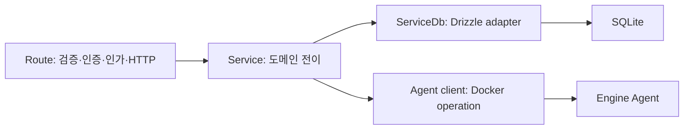

# API, 데이터, 인증 지시서

## 1. Hono 계층

- Route는 `createXxxRoute(deps)` factory이며 Hono 인스턴스를 반환한다.
- 모든 JSON·query·param은 Zod validator를 사용한다.
- 모든 handler는 `withErrorHandling` 바깥, `withAuth`·`withCapability` 안쪽 순으로 합성한다.
- Service는 Hono Context와 Drizzle을 받지 않는다.
- DB query와 transaction은 compose의 `*ServiceDb` 구현에만 둔다.
- Agent client는 Service dependency이며 Docker SDK type을 도메인에 누출하지 않는다.
- 모든 응답은 success, paginated, error helper를 사용한다.

## 2. API 그룹

동일 Hono route 계약을 두 ingress profile로 노출한다.

- 패널 profile: `panel.<domain>`의 `/api/*`, Cloudflare Access와 session cookie, auth·invite UI 포함
- 외부 profile: `api.<domain>`의 `/api/*`, 애플리케이션 API 키만 허용, session·auth route 제외

middleware는 Host 문자열만 신뢰하지 않고 Nginx가 내부 network에서 서명해 전달한 ingress profile을 검증한다.

| prefix               | 주요 기능                                                       |
| -------------------- | --------------------------------------------------------------- |
| `/api/auth/*`        | Better Auth handler                                             |
| `/api/session`       | 현재 사용자와 capability                                        |
| `/api/dashboard/*`   | overview, engine health, jobs summary                           |
| `/api/containers/*`  | list, detail, lifecycle, exec ticket, logs, stats, archive      |
| `/api/images/*`      | list, inspect, pull, tag, remove, load 연결                     |
| `/api/networks/*`    | list, inspect, create, connect, disconnect, remove              |
| `/api/volumes/*`     | list, inspect, create, remove                                   |
| `/api/nginx/*`       | status, routes, revisions, validate, apply, rollback, error log |
| `/api/traffic/*`     | overview, series, top, slow, errors, live, export               |
| `/api/uploads/*`     | upload session, chunks, 검사 결과                               |
| `/api/deployments/*` | create, detail, versions, rollback                              |
| `/api/jobs/*`        | 상태, cancel, SSE events                                        |
| `/api/users/*`       | invite, role, disable                                           |
| `/api/api-keys/*`    | create, list metadata, revoke, rotate                           |
| `/api/audit/*`       | filter, detail, export                                          |
| `/api/backups/*`     | local control·traffic backup list, create, restore, remove      |
| `/api/system/*`      | engine info, disk usage, backups, maintenance                   |
| `/ws/exec/:ticket`   | TTY stream                                                      |
| `/events/docker`     | Docker event SSE                                                |

## 3. 응답과 오류

성공 응답은 `{ success: true, data }`, 페이지 응답은 `{ success: true, data, pagination }`, 실패는 `{ success: false, error: { code, message, requestId, details? } }`다. production에서 내부 stack과 raw Engine payload를 details에 넣지 않는다.

오류 코드는 도메인 접두사를 사용한다.

- `AUTH_*`, `CAPABILITY_*`, `RATE_LIMITED`
- `DOCKER_*`, `CONTAINER_*`, `IMAGE_*`, `NETWORK_*`, `VOLUME_*`
- `NGINX_*`, `TRAFFIC_*`
- `UPLOAD_*`, `DEPLOYMENT_*`, `BACKUP_*`, `JOB_*`
- `VALIDATION_ERROR`, `CONFLICT`, `INTERNAL_ERROR`

장시간 operation은 즉시 `202`와 job을 반환한다. 동기 endpoint timeout을 길게 늘려 pull, load, build, prune, export, deployment를 기다리지 않는다.

## 4. idempotency와 concurrency

- create, upload complete, deployment, destructive bulk operation은 `Idempotency-Key`를 요구한다.
- 동일 actor·route·key·body digest는 기존 결과를 반환한다.
- body가 다른 key 재사용은 conflict다.
- Nginx revision apply와 resource update는 expected version 또는 checksum을 요구한다.
- container action 직전에 inspect하고 expected state가 다르면 conflict와 현재 상태를 반환한다.
- 같은 target의 상충 job은 resource lock row로 직렬화한다.

## 5. control DB schema

### 5.1 인증

- Better Auth core: user, session, account, verification
- `user_role`: userId, role, createdAt
- API key plugin tables와 permission metadata
- `invitation`: tokenHash, email, role, createdBy, expiresAt, acceptedAt, revokedAt

### 5.2 Docker metadata

- `docker_target`: id, name, endpointType, status, engineVersion, apiVersion, lastSeenAt
- `resource_metadata`: targetId, resourceType, resourceId, displayName, managed, labels, lastSeenAt
- `resource_snapshot`: targetId, resourceType, resourceId, observedAt, normalizedJson, stateHash

snapshot은 짧게 보존하고 현재 판단에 사용하지 않는다.

### 5.3 Nginx

- `nginx_route`: stable route identity와 desired fields
- `nginx_revision`: revision, parent, status, renderedChecksum, author, createdAt
- `nginx_revision_file`: revisionId, relativePath, content, contentChecksum
- `nginx_apply`: revisionId, previousRevisionId, status, validationOutput, probeOutput, startedAt, finishedAt

### 5.4 upload·deployment·job

- `upload`: type, originalName, byteSize, digest, state, owner, expiresAt
- `upload_chunk`: uploadId, index, byteSize, digest, receivedAt
- `artifact_scan`: uploadId, scanner, policyVersion, result, findingsSummary
- `deployment`: name, currentVersionId, routeId, status
- `deployment_version`: deploymentId, artifactId, imageDigest, containerId, manifestJson, status
- 현재 `operation_job`: id, kind, status, payload, result, failureCode, attempt, maxAttempts, progressStep, createdBy, scheduledAt, startedAt, heartbeatAt, cancelRequestedAt, finishedAt, createdAt, updatedAt
- 현재 `operation_job_event`: id, jobId, event, detail, createdAt
- 향후 resource lock과 범용 idempotency metadata는 operation별 계약이 확정될 때 migration으로 추가한다.

### 5.5 운영

- `audit_log`: append-only operation record
- `saved_view`: owner, domain, name, queryJson
- `system_setting`: typed non-secret setting과 version
- `secret_reference`: provider와 key reference만 저장
- 현재 backup manifest file: schema version, control·traffic byte 수·digest, label, 생성 시각
- 향후 `backup_record`: durable job, location reference, verify·replication status
- `notification_destination`: type, secretReference, enabled, filterJson
- `disk_observation`: source, totalBytes, usedBytes, availableBytes, observedAt

## 6. traffic DB와 수집 상태

### 6.1 현재 구현

- traffic DB에는 `access_event` 한 테이블이 있다.
- 열은 `request_id`, `occurred_at`, `client_ip`, `host`, `method`, `uri_path`, `status`, `request_time_ms`, `bytes_sent`, `country`, `user_agent`, `raw_json`이다.
- `request_id`가 primary key이며 `INSERT OR IGNORE`로 재수집 중복을 제거한다. `occurred_at`, `status` index를 사용한다.
- 수집 checkpoint는 DB table이 아니라 Worker 전용 `/data/ingest-checkpoint.json`에 version, device, inode, offset, oversized-line 폐기 상태, updatedAt을 원자 저장한다. 파일 mode는 `0600`이다.
- export는 traffic DB table을 별도로 만들지 않는다. control DB의 `operation_job` 중 `traffic.export`가 작업 상태를 소유하고 결과 파일은 `/backups/traffic-exports`에 14일 보존한다.
- Traffic Worker만 traffic DB를 쓰고 API는 내부 HMAC RPC로 조회·backup·export를 요청한다. API는 traffic DB 파일을 직접 mount하거나 connection으로 열지 않는다.

### 6.2 후속 목표

- `traffic_minute_rollup`: bucket·host·route·container 기준 count와 merge 가능한 latency histogram
- `traffic_hour_rollup`: 장기 조회용 집계
- 구조화된 ingest failure ledger와 redacted sample
- rollup 재생성·검증 migration과 saved view

이 항목은 아직 구현되지 않았다. traffic schema migration ownership은 계속 Worker package에 둔다.

## 7. Better Auth 통합

- Hono API가 Better Auth instance와 `/api/auth/*` handler를 소유한다.
- Drizzle SQLite adapter를 사용한다.
- Next.js는 같은 origin cookie를 전달해 Hono session endpoint로 SSR auth를 검증한다.
- layout에서 한 번 숨기는 것으로 권한을 보장하지 않고 각 Server Component data access와 Hono mutation에서 재검증한다.
- 최초 시작은 owner 미존재일 때만 짧은 bootstrap mode를 제공한다. bootstrap 완료 후 endpoint는 404 또는 고정 거부다.
- 이메일 발송을 구성하지 않은 초기 버전은 owner가 패널에서 단회 invitation link를 생성한다.
- invitation link는 운영자가 안전한 별도 채널로 전달하며 Discord webhook에 자동 게시하지 않는다.

## 8. TanStack Query와 SSR

- App Router page와 layout은 Server Component가 기본이다.
- 첫 화면의 container list, overview, Nginx status처럼 즉시 필요한 데이터는 server에서 Hono를 호출하고 prefetch·dehydrate한다.
- client widget은 같은 `queryOptions` factory를 `useSuspenseQuery` 또는 `useQuery`로 재사용한다.
- Docker event SSE는 `QUERY_KEY` prefix를 invalidate한다.
- mutation hook이 성공 시 관련 key만 invalidate하고 Sonner feedback을 낸다.
- global default staleTime은 60초로 시작하되 live engine 상태는 더 짧게, immutable revision은 더 길게 지정한다.
- exec·logs follow·stats stream은 TanStack Query cache에 넣지 않고 dedicated stream hook을 사용한다.

## 9. 설정과 secret

- API가 `getEnv()` singleton과 Zod로 환경변수를 검증한다.
- `.env.example`에는 key 이름과 설명만 둔다.
- production secret은 Docker secrets 또는 선택한 external secret provider에서 읽는다.
- UI로 입력한 workload secret은 암호화 저장 정책이 확정되기 전까지 persistent 저장하지 않는다.
- non-secret system setting은 DB versioning과 audit를 적용한다.

## 10. API 문서

- 비production에서만 OpenAPI JSON과 Swagger UI를 노출한다.
- 외부 자동화 문서는 API key scope, idempotency, pagination, job, SSE reconnect, rate limit, error code를 포함한다.
- Hono RPC type은 내부 web에 사용하고 외부 클라이언트의 장기 계약은 versioned OpenAPI로 제공한다.
- breaking API는 `/api/v2` 또는 명시적 media version으로 올린다.
- OpenAPI example과 error code 설명은 `ko`, `en`, `ja` 문서 catalog로 제공하되 wire response는 안정된 locale-independent code를 유지한다.
