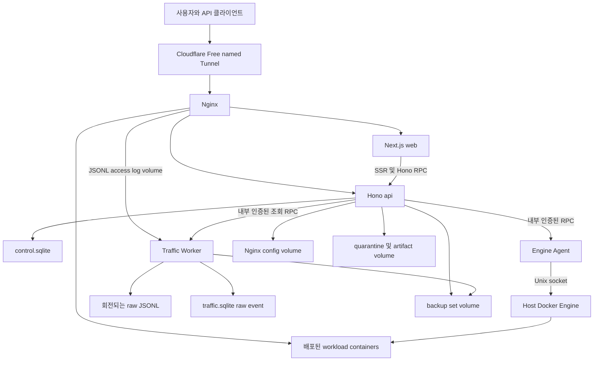

# 전체 아키텍처

## 1. 권장 배치 단위

M1 Max macOS의 Docker Desktop Linux VM 안에서 Docker Compose로 묶인 다중 컨테이너 애플리케이션을 사용한다. 외부에서는 하나의 서버 제품처럼 보이지만 권한과 장애를 분리한다.

| 서비스           | 역할                                                     |                외부 노출 | Docker socket |
| ---------------- | -------------------------------------------------------- | -----------------------: | ------------: |
| `nginx`          | 최초 ingress, 관리·워크로드 라우팅, access log           |  Cloudflare Tunnel에서만 |          없음 |
| `web`            | Next.js App Router, SSR/RSC, 패널 UI                     |               Nginx 경유 |          없음 |
| `api`            | Hono RPC, 인증·인가, jobs, 구성 관리                     |               Nginx 경유 |          없음 |
| `engine-agent`   | Docker Engine 어댑터와 스트림 중계                       |                 내부망만 |     읽기·쓰기 |
| `traffic-worker` | Nginx JSONL tail, 검증, raw 저장, 조회·live·export       |                 내부망만 |          없음 |
| `egress-broker`  | DNS 해석·webhook 발송 대행 (유일한 outbound egress 보유) |      인바운드는 내부망만 |          없음 |
| `backup-worker`  | 선택적 R2 업로드·bounded snapshot 전용 worker 후보       |          계획, 아직 없음 |          없음 |
| `watchdog`       | 관리 plane·Nginx 생존 probe와 last-known-good 복구       |          계획, 아직 없음 |          없음 |
| `cloudflared`    | remotely-managed outbound-only named tunnel              | 호스트 배치 계획, 미구현 |          없음 |

Nginx access log, SQLite DB, 업로드 격리소, Nginx 설정 리비전은 각각 명시된 named volume에 둔다. `engine-agent`만 `/var/run/docker.sock`을 가진다.

현재 Compose에 실제 존재하는 서비스는 `nginx`, `web`, `api`, `engine-agent`, `traffic-worker`, `egress-broker` 여섯 개다. 로컬 backup 조정은 API와 Traffic Worker가 shared named volume에서 담당하며 별도 `backup-worker`는 아직 없다.

## 2. 논리 구성

## 3. 신뢰 경계

1. 인터넷과 Cloudflare 경계: Cloudflare 헤더는 tunnel 네트워크에서 온 요청에만 신뢰한다.
2. Nginx와 관리 plane 경계: 관리 hostname은 workload hostname과 분리하고 route 우선순위를 고정한다.
3. API와 Engine Agent 경계: 외부에서 Agent로 연결할 수 없으며 내부 서비스 인증과 요청 서명을 검증한다.
4. Engine Agent와 Docker 경계: 이 경계는 사실상 host root 권한이다. 모든 입력을 typed operation으로 축소한다.
5. 업로드 경계: 업로드 파일은 검사가 끝날 때까지 Docker Engine과 Nginx 설정 volume에 닿지 않는다.
6. 로그 경계: access log는 외부 입력으로 취급해 스키마 검증하고 제어 문자와 과대 필드를 제한한다.
7. Docker Desktop 경계: Agent의 root는 Linux VM 안의 root지만 socket을 통해 Engine 전체와 공유된 macOS 경로에 영향을 줄 수 있으므로 root-equivalent로 취급한다.

## 4. 상태의 단일 출처

| 상태                                     | 단일 출처                                | DB의 역할                                |
| ---------------------------------------- | ---------------------------------------- | ---------------------------------------- |
| 컨테이너·이미지·network·volume 현재 상태 | Docker Engine inspect/list/events        | 사용자 메타데이터와 마지막 관측 snapshot |
| Nginx desired config                     | `control.sqlite`의 immutable revision    | draft·검증·적용 이력                     |
| Nginx 실제 적용 config                   | 적용 volume의 checksum과 실행 중 Nginx   | 마지막 관측 checksum                     |
| 사용자·세션·API 키                       | `control.sqlite`                         | 원본                                     |
| 장기 작업 상태                           | `control.sqlite`의 `operation_job`·event | API job worker가 claim·heartbeat·종결    |
| raw 트래픽                               | Nginx JSONL과 `traffic.sqlite` event     | worker가 JSONL을 검증·영속화             |
| 현재 트래픽 분석 결과                    | `traffic.sqlite` raw event               | exact 조회·집계, live·export             |
| 향후 장기 rollup                         | `traffic.sqlite` rollup table            | 아직 구현되지 않음                       |

Docker events가 유실될 수 있으므로 이벤트는 갱신 신호로만 사용한다. 일정 주기와 화면 요청 시 list·inspect로 재조정한다.

## 5. 요청 경로

### 5.1 관리 패널

`panel.example.com/*`는 Cloudflare Access를 통과한 뒤 Next.js로 전달한다. 이 호스트의 `/api/*`, `/api/auth/*`, `/events/*`, `/ws/*`는 브라우저 session용 Hono API로 전달한다. Next.js SSR은 내부 URL로 Hono를 호출하고 사용자 cookie와 요청 ID를 전달한다.

### 5.2 외부 자동화 API

`api.example.com/*`는 Cloudflare Tunnel을 통과하지만 Access service token을 요구하지 않는다. 애플리케이션 API 키만 인증 수단으로 허용하고 session cookie는 무시한다. CORS는 기본 비활성화하며 패널 cookie의 Domain을 이 호스트와 공유하지 않는다.

### 5.3 사용자 워크로드

`<route>.apps.example.com` 또는 명시 도메인은 적용된 Nginx route revision으로 대상 컨테이너의 내부 주소와 포트에 전달한다. 관리 hostname과 충돌하는 route는 생성 단계에서 거부한다.

### 5.4 Docker 작업

Hono Route가 인증·DTO 검증·인가·위험도 판정을 수행하고 job을 생성한다. Service가 도메인 전이를 결정하고 Agent client를 호출한다. Engine Agent가 DTO를 다시 검증하고 Docker Engine API로 변환한다. 결과는 정규화한 뒤 job event와 audit log에 기록한다.

## 6. 장애 격리

- `web` 장애: API와 기존 workload routing은 계속 동작한다.
- `api` 장애: Nginx와 workload는 계속 동작하고 변경 작업만 중단된다.
- `engine-agent` 장애: Docker 변경·stream 기능만 중단되고 조회 화면은 명시적 degraded 상태가 된다.
- `traffic-worker` 장애: 프록시는 계속 동작하고 raw log가 volume에 쌓인다. 복구 후 offset부터 재처리한다.
- **API 다중 인스턴스 전제**: durable job queue 는 다중 인스턴스에서 안전하도록 세 겹으로 막는다. ① claim 은 `WHERE id = ? AND status = 'queued'` 조건부 UPDATE 라 두 인스턴스가 같은 job 을 잡을 수 없다. ② claim 시 프로세스마다 부팅 때 만든 `worker_id` 를 기록하고, 부팅 회수(`reconcileInterrupted`)는 **자기 worker_id 또는 NULL(구버전) 행만** 되돌린다 — 다른 인스턴스가 실행 중인 job 을 죽이지 않는다. ③ `(kind, resource_key)` 활성 상태 부분 유니크 인덱스가 리소스 잠금을 DB 레벨에서 강제한다(애플리케이션 조회만으로는 경합에서 새어나갈 수 있다). 죽은 인스턴스의 job 은 heartbeat 기준 stall sweep 이 회수한다.
- 그 외 상태(점검 모드는 DB 영속화, rate limit·SSE 구독자 목록은 프로세스 메모리)는 여전히 인스턴스별이다. rate limit 은 인스턴스 수만큼 느슨해지고 SSE 는 연결된 인스턴스에서만 이벤트를 받는다.
- `traffic-worker` 는 쓰기(수집·보존 정리)와 읽기(분석·export)를 분리한다. 분석·export 조회는 읽기 전용 SQLite 연결을 가진 별도 Worker thread 에서 실행한다. `bun:sqlite` 가 동기 API 라 같은 스레드에서 돌면 큰 범위 조회가 이벤트 루프를 막아 `/health` 응답까지 지연되기 때문이다. export 는 keyset pagination 으로 5,000행씩 읽어 파일에 이어 쓰고 sha256 을 증분 계산한다.
- Nginx reload 실패: 기존 worker와 설정을 유지하고 새 revision을 failed로 표시한다.
- SQLite 손상·disk full: 변경 작업을 fail-closed하고 기존 라우팅은 유지한다.

## 7. 확장 경로

첫 버전은 `dockerTargetId`를 모든 Docker 관련 테이블과 API에 포함하되 실제 target은 하나만 생성한다. 다중 호스트가 필요해지면 각 호스트에 Engine Agent를 배치하고 mTLS로 연결한다. API 계약과 UI route를 바꾸지 않고 target selector만 활성화한다.

## 8. macOS와 disk 경계

- 지원 host는 macOS Docker Desktop(Apple Silicon 기준 개발·검증)과 rootful Docker Engine 을 쓰는 Linux 다. Linux 는 `DOCKER_GID` 로 docker 소켓 그룹을 주입해야 engine-agent 가 Engine 에 붙는다(`compose.yaml` `group_add`, `scripts/setup.sh` 가 자동 탐지). 기본 workload platform 은 `linux/arm64` 이며, Linux 실기 검증은 아직 수행되지 않았다.
- `linux/amd64`는 Docker Desktop 에뮬레이션 가용성을 검사한 뒤 선택적으로 허용한다.
- 384GB 설정값, Engine `/system/df`, 제품 volume의 filesystem `statfs`, 영역별 quota를 서로 다른 신호로 저장·표시한다.
- macOS host 전체 free disk는 Engine API의 보장 범위가 아니다. 별도 지원 integration 없이 정확한 host 수치라고 표시하지 않는다.
- upload·build admission은 filesystem available bytes, 영역 quota, 예약 중인 job bytes 중 가장 보수적인 값으로 판정한다.
