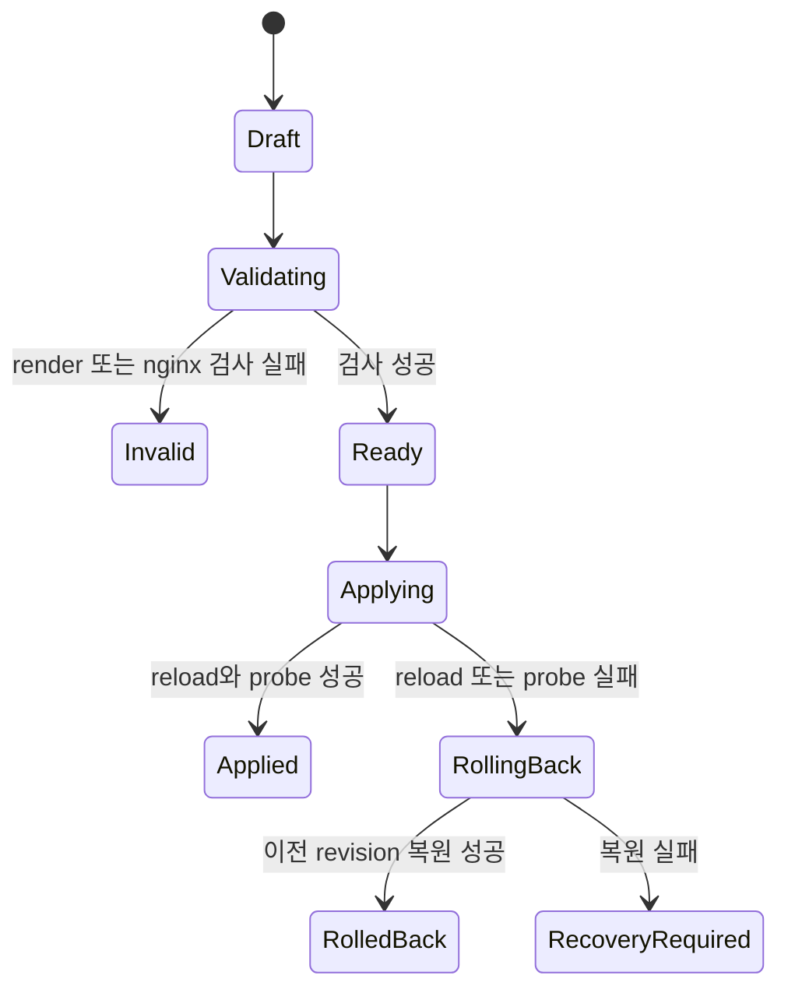

# Nginx 설정과 트래픽 분석

## 1. Nginx 역할

Nginx는 요청의 최초 애플리케이션 계층 진입점이며 다음만 책임진다.

- 관리 hostname과 workload hostname 분리
- Next.js, Hono API, SSE, WebSocket, 사용자 컨테이너 reverse proxy
- 요청 크기·timeout·connection·rate 기본 방어
- request ID 생성·전파
- JSON access log와 error log 생성
- 적용된 revision의 graceful reload

분석·대시보드 집계·장기 저장은 Nginx worker에서 하지 않고 `traffic-worker`가 담당한다.

## 2. hostname과 route 우선순위

1. exact 패널 hostname
2. exact 외부 API hostname
3. exact 사용자 custom domain
4. wildcard 사용자 app domain
5. catch-all reject

패널과 API hostname은 사용자 route로 등록할 수 없다. `/api`, `/api/auth`, `/events`, `/ws`, Next static 경로는 패널 server block 안에서 명시적으로 분리한다. 외부 API server block은 API key 인증 경로만 허용하고 auth·session route를 차단한다. 사용자 container가 관리 cookie나 내부 header를 받지 않도록 각 server block의 header set을 따로 정의한다.

## 3. 설정 모델

### 3.1 구조화 route

- hostname
- path prefix 또는 exact path
- target container ID와 내부 port
- protocol http 또는 websocket
- stripPrefix
- upstream timeout
- body size limit
- health path와 expected status
- forwarded header policy
- enabled

container IP를 설정에 고정하지 않는다. 사용자 container를 관리 network에 연결하고 안정된 DNS name 또는 Agent가 생성한 upstream alias를 사용한다.

### 3.2 전체 `nginx.conf` 편집

owner는 구조화 모델 대신 전체 config tree를 편집할 수 있다. 이는 단순 syntax editor가 아니라 관리 plane의 생존을 바꾸는 break-glass 작업이다.

- owner와 최근 재인증, 변경 사유, 대상명 재입력, 만료형 break-glass grant를 요구한다.
- include path escape, 사용 불가 module, 외부 listener, log destination, resolver, executable extension을 정적 검사한다.
- 패널 SSR, 브라우저 API, 외부 API, WebSocket, SSE, workload, JSON access log, status, rollback hook에 필요한 보호 계약을 AST 또는 rendered-config 검사로 강제한다.
- 실행 중 인스턴스와 동일한 image·module·environment의 shadow container를 실제 기동해 전체 probe를 통과시킨다.
- last-known-good 설정은 raw revision과 분리된 read-only recovery 영역에 두고 `api`와 독립된 watchdog만 복구할 수 있게 한다.

## 4. revision 적용 상태 기계

### 4.1 적용 순서

1. DB revision을 immutable snapshot으로 고정한다.
2. 임시 디렉터리에 전체 config tree를 deterministic render한다.
3. file path와 include graph를 검사한다.
4. 실행 중 Nginx와 동일 image·module·env로 `nginx -t`를 수행한다.
5. shadow Nginx를 기동하고 패널 SSR, 브라우저 API, 외부 API, WebSocket, SSE, workload, log probe를 수행한다.
6. 현재 적용 디렉터리 checksum과 예상 base revision이 같은지 optimistic lock을 확인한다.
7. 새 디렉터리를 원자적으로 current symlink 또는 rename으로 교체한다.
8. HUP graceful reload를 요청한다.
9. master process, worker generation, error log, 관리 health, 변경된 workload health를 확인한다.
10. 관찰 window에서 오류율과 외부·내부 synthetic probe를 확인한다.
11. 성공 checksum과 시각을 기록한다.
12. 실패하거나 관리 생존 신호가 사라지면 watchdog이 이전 snapshot을 원자 복원하고 다시 reload·probe한다.

Nginx는 새 설정 적용에 실패하면 기존 설정과 worker를 유지하지만, 애플리케이션도 파일·DB 상태가 엇갈리지 않도록 명시적 rollback을 수행한다.

## 5. access log 계약

`log_format`은 `escape=json`을 사용하고 한 요청을 한 JSON line으로 기록한다. 다음 필드를 최소 계약으로 둔다.

| 필드                                        | 내용                                           |
| ------------------------------------------- | ---------------------------------------------- |
| `schema_version`                            | 로그 schema version                            |
| `timestamp`                                 | ISO 8601 또는 epoch millisecond                |
| `request_id`                                | Nginx `$request_id`, 응답과 upstream에 전파    |
| `cf_ray`                                    | Cloudflare request identifier                  |
| `client_ip`                                 | 검증된 원본 IP, raw retention과 제한 조회 적용 |
| `country`                                   | 검증된 Cloudflare country header               |
| `scheme`, `host`, `server_name`             | 요청 origin과 매칭 server                      |
| `method`, `uri_path`                        | query와 분리한 경로                            |
| `query_present`                             | query 존재 여부, 원문은 기본 미저장            |
| `protocol`                                  | HTTP protocol                                  |
| `status`                                    | 최종 status                                    |
| `request_length`, `bytes_sent`              | 수신·송신 크기                                 |
| `request_time`                              | 전체 처리 시간                                 |
| `upstream_addr`, `upstream_status`          | 대상과 결과                                    |
| `upstream_connect_time`                     | 연결 지연                                      |
| `upstream_header_time`                      | 첫 header 지연                                 |
| `upstream_response_time`                    | upstream 완료 지연                             |
| `route_id`, `deployment_id`, `container_id` | Nginx map으로 주입한 관리 metadata             |
| `user_agent`                                | 길이 제한된 값                                 |
| `referer_host`                              | 전체 URL 대신 host 또는 미저장                 |

Authorization, Cookie, request·response body, 전체 query string, API key를 기록하지 않는다. URI에 secret이 포함될 수 있으므로 configurable path redaction을 적용한다.

## 6. 수집 파이프라인

### 6.1 현재 구현

1. Nginx가 shared volume의 active JSONL 파일에 append한다.
2. traffic worker가 `device + inode + offset` checkpoint를 읽고, rename rotation이면 old inode를 EOF까지 먼저 소비한다.
3. 완성 line을 크기 제한 후 JSON parse하고 Zod schema version으로 검증한다.
4. Nginx `request_id`를 `access_event` primary key로 사용하고 `INSERT OR IGNORE` batch transaction으로 중복을 막는다.
5. DB transaction이 성공한 뒤에만 checkpoint JSON을 임시 파일과 rename으로 원자 갱신한다. DB 실패 시 offset은 전진하지 않는다.
6. 새로 삽입된 event만 bounded live subscriber에 masked DTO로 전달하고 raw row retention을 정리한다.

로그 rotation은 파일 rename 후 Nginx USR1 reopen을 사용한다. Worker는 old inode EOF까지 읽고 new inode로 전환한다. DB 장애 시 file offset을 advance하지 않는다.

### 6.2 후속 목표

- minute/hour rollup과 route·status·latency histogram 갱신
- ingest lag, invalid·duplicate·dropped line, disk usage의 Prometheus 형식 metric
- 구조화된 ingest failure ledger와 운영 화면

## 7. 데이터 모델과 집계

### 7.1 raw event

현재 `access_event`는 request ID, 시간, 원본 client IP, host, method, URI path, status, latency, bytes, country, user agent와 `raw_json`을 저장한다. 일반 live·export 응답은 IP를 mask하고 user agent와 raw JSON을 제외한다. `raw_json` 제거는 raw file 복구와 rollup 재생성 검증이 먼저 끝난 뒤 별도 migration으로 판단한다.

권장 index:

- timestamp
- host + timestamp
- routeId + timestamp
- containerId + timestamp
- status + timestamp
- requestId unique 또는 lookup
- cfRay lookup

### 7.2 rollup

다음은 아직 구현되지 않은 목표 schema다.

- minute bucket + host + route + container
- count, 2xx·3xx·4xx·5xx, bytes in·out
- upstream error·timeout count
- latency histogram 또는 merge 가능한 bucket counts
- max latency와 exemplar request ID

p50·p95·p99를 정확히 재계산할 수 있는 histogram bucket을 저장한다. 평균만 저장하지 않는다. 현재 window가 raw retention 안이면 raw 기반 drill-down을 제공하고 장기 화면은 rollup을 사용한다.

## 8. 대시보드와 API

- overview: RPS, 총 요청, 오류율, p50·p95·p99, traffic bytes, ingest health
- time series: 전체, 4xx, 5xx, latency percentile
- top: host, route, container, upstream, status, country, user agent
- slow requests: duration과 upstream 구간 분해
- errors: request ID, status, route, upstream status, container·deployment 연결
- live tail: bounded SSE, 필터, pause, dropped count
- saved view: 기간, host, route, container, status, latency threshold
- export: time-bounded CSV 또는 NDJSON job

현재 구현(0021)은 최대 24시간 범위, owner/admin durable job, CSV/NDJSON, masked IP, user agent 제외, 14일 파일 retention을 제공한다. live tail은 Worker/API bounded SSE와 Web 25행 pause/resume buffer를 사용한다.

필터는 query string과 API DTO의 단일 schema를 공유한다. 서버에서 UTC range를 사용하고 화면만 local time으로 변환한다.

## 9. Nginx 패널

- 상태: version, master PID, worker 수, uptime, current revision checksum, last reload
- routes: hostname·path·target·health·enabled 표
- revision: draft, diff, validation output, author, timestamps, apply·rollback
- full config: syntax highlight, file tree, diff, 정적 정책·shadow probe 결과, 위험 경고
- reload history: 성공·실패·rollback과 probe 결과
- live error log: bounded, secret redaction, level filter

저장 버튼은 draft만 만들고 적용 버튼은 별도다. applied revision을 직접 편집하지 않고 항상 새 revision을 만든다.

## 10. 보존과 개인정보

추천 기본값:

- raw JSONL: 7일, 일 단위 gzip 또는 zstd 압축
- raw traffic rows: 14일
- minute rollup: 90일
- hour rollup: 1년
- audit: 1년
- client IP: 원본을 raw row에 14일 저장, 일반 UI mask, 제한된 상세 열람

보존 purge 전 disk watermark를 감시하고 hard watermark에서는 업로드·배포를 차단하되 프록시와 log append를 우선한다. 원본 IP는 rollup, Discord webhook, 일반 export에 복제하지 않으며 열람·보안 export를 별도로 감사한다.
