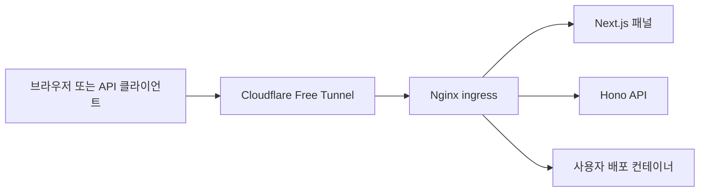

# 제품 요구사항

## 1. 제품 정의

Containers는 M1 Max Apple Silicon macOS의 Docker Desktop 단일 호스트를 웹 패널과 외부 API만으로 운영하는 자체 호스팅 제어판이다. 관리자는 호스트에 터미널로 접속하지 않고 컨테이너·이미지·네트워크·볼륨·Nginx 라우팅·트래픽·배포·감사 기록을 관리한다.

외부 요청 경로는 다음과 같다.

## 2. 핵심 사용자

- 소유자: 최초 설정, 사용자·권한·보안 정책·모든 파괴적 작업 승인
- 관리자: Docker·Nginx·배포·API 키 전반 관리
- 운영자: 일상적인 시작·중지·재시작·로그·exec·배포 수행
- 조회자: 상태·트래픽·로그·감사 기록만 조회
- 감사자: 감사·원본 IP·보안 조사 데이터를 제한적으로 조회
- API 클라이언트: 발급된 범위와 만료시간 안에서 자동화 수행

초기 버전은 단일 호스트·단일 조직을 기준으로 한다. 다중 호스트·다중 조직은 데이터 모델 확장점을 남기되 첫 구현 범위에 넣지 않는다.

## 3. 기능 요구사항

### 3.1 진입과 라우팅

- Nginx가 모든 origin 요청의 최초 애플리케이션 계층 진입점이다.
- Access와 session을 요구하는 관리 도메인, API 키만 요구하는 외부 API 도메인, 사용자 워크로드 도메인을 분리한다.
- Nginx는 관리 패널, Hono API, WebSocket, SSE, 사용자 컨테이너로 요청을 라우팅한다.
- Cloudflare가 전달한 원본 요청 메타데이터를 신뢰할 수 있는 경로에서만 해석한다.
- 관리 패널은 Cloudflare Access를 필수 외곽 방어선으로 사용한다. 외부 API는 애플리케이션 API 키만 사용한다.

### 3.2 Docker 상태와 제어

- 컨테이너 목록·상세·inspect·상태·health·stats·top·logs·changes를 조회한다.
- create, start, stop, restart, pause, unpause, kill, rename, update, wait, remove를 지원한다.
- exec는 비대화형과 TTY 대화형을 모두 지원하고 리사이즈·stdin·stdout·stderr·종료 코드를 처리한다.
- 이미지 목록·inspect·history·pull·tag·load·import·build·prune·remove를 단계적으로 지원한다.
- 네트워크와 볼륨의 목록·inspect·create·connect·disconnect·remove·prune을 지원한다.
- Docker events, info, version, disk usage, system prune를 지원한다.
- 현재 상태의 단일 출처는 Docker Engine이다. DB 캐시는 표시 가속용이며 명령 판단에 쓰지 않는다.

### 3.3 Nginx 관리

- 구조화된 라우트 편집과 owner 전용 전체 `nginx.conf` 편집을 제공한다.
- draft, validation, applied, failed, rolled-back 상태를 가진 설정 리비전을 저장한다.
- 저장과 적용을 분리하고 diff를 보여준다.
- 적용 전 정적 정책 검사, 동일 이미지 shadow 기동과 관리·API·stream·workload probe, 파일 원자 교체, graceful reload, 적용 후 관찰을 수행한다.
- 실패하면 이전 정상 리비전으로 자동 복원하고 원인과 출력을 저장한다.
- 현재 master/worker 상태, 적용 checksum, 마지막 성공·실패 시각, reload 이력을 표시한다.

### 3.4 트래픽 수집과 분석

- Nginx와 별도 프로세스가 access log를 수집·검증·저장·집계한다.
- 요청 ID, Cloudflare Ray ID, host, route, method, status, byte, 전체·upstream 구간 지연, upstream 주소, 프로토콜, user agent, 원본 client IP를 기록한다.
- 대시보드와 API에서 요청량, 오류율, 상태군, p50·p95·p99, 전송량, 활성 host·route·upstream, 느린 요청, 최근 오류를 조회한다.
- 원본 로그와 집계의 보존 기간, IP 개인정보 정책, 로그 누락·파싱 실패·지연 상태를 운영자가 확인한다.
- 로그 회전, 프로세스 재시작, 부분 라인, 중복 입력에서도 유실·중복을 감지한다.

### 3.5 업로드와 배포

- 로그인 세션과 API 키 양쪽에서 스트리밍 업로드를 지원한다.
- Docker image archive와 압축 변형, OCI archive, rootfs archive, 제품 Compose bundle, Dockerfile build context를 첫 버전부터 명시적으로 구분해 지원한다.
- upload session은 기본 10GiB이고 64MiB resumable chunk를 사용해 Cloudflare Free의 단일 요청 한도 안에서 전송한다.
- 업로드는 격리 저장, 크기 제한, checksum, 형식 식별, 경로 순회·압축 폭탄, secret, malware, critical vulnerability 검사 후에만 Engine으로 전달한다.
- 업로드, 이미지 로드, 컨테이너 생성, health 확인, Nginx route 반영을 하나의 추적 가능한 deployment job으로 묶는다.
- 배포 실패 시 신규 컨테이너와 라우트를 정리하고 직전 정상 버전으로 복원한다.

### 3.6 인증과 API 키

- Drizzle과 SQLite를 사용하는 Better Auth 세션 인증을 적용한다.
- 공개 회원가입은 기본 비활성화하고 최초 소유자 bootstrap과 관리자 초대만 허용한다.
- 권한은 서버에서 매 요청 재검증한다.
- 패널에서 API 키를 발급·조회·회수하고 키 원문은 생성 시 한 번만 보여준다.
- API 키는 해시 저장, scope, 만료, rate limit, 최근 사용 시각을 가진다.

### 3.7 감사와 작업

- 모든 상태 변경과 민감 조회를 actor, 인증 방식, 대상, 요청 ID, 입력 요약, 결과, 소요시간과 함께 감사 로그로 남긴다.
- 장시간 작업은 job으로 실행하고 queued, running, succeeded, failed, cancelled 상태와 progress event를 제공한다.
- 위험 작업은 재인증, 대상명 재입력, 영향 미리보기 중 위험도에 맞는 확인 단계를 거친다.

## 4. 비기능 요구사항

- 관리 기능은 호스트 터미널 없이 패널 또는 API에서 완결되어야 한다.
- 관리 plane 장애가 기존 Nginx 프록시와 사용자 컨테이너의 실행을 중단시키지 않아야 한다.
- 잘못된 Nginx 설정은 현재 정상 설정을 덮어쓰지 않아야 한다.
- API와 Engine Agent가 재시작되어도 job과 감사 기록을 복구할 수 있어야 한다.
- 모든 외부 입력은 Zod 경계 검증을 거친다.
- 명령어 문자열 연결, 사용자 입력의 셸 삽입, 임의 host path 접근을 금지한다.
- 반응형 UI, 키보드 조작, 명확한 로딩·빈 상태·부분 실패·오류 복구를 제공한다.
- 한국어·영어·일본어를 첫 release에서 제공하고 locale registry와 catalog 추가만으로 후속 언어팩을 연결한다.
- 서비스는 UTC로 저장·교환하고 화면에서 사용자 시간대로 표시한다.
- Docker Desktop disk, Engine object, 제품 volume·quota 사용량을 동적으로 표시하고 disk pressure 전에 업로드·build를 차단한다.
- 로컬 회전 backup과 restore drill을 제공하고 Cloudflare R2 offsite backup은 선택 기능으로 제공한다.
- Discord webhook으로 장애와 위험 작업을 알리며 SMTP는 제공하지 않는다.

## 5. 범위 밖

- Kubernetes, containerd 직접 제어, Podman 호환
- 다중 Docker 호스트 클러스터 스케줄링
- 완전한 CI/CD 플랫폼이나 Git 호스팅
- 사용자 워크로드 내부 애플리케이션 데이터 백업
- macOS host의 일반 셸, 패키지 관리자, launchd, Docker Desktop 밖 파일 시스템 전체를 임의 조작하는 기능
- Linux production, Intel Mac production, 원격 Docker host
- 첫 버전의 과금·멀티테넌시·조직 간 격리

## 6. 제품 완료 조건

- 인수 조건은 [quality-assurance/ACCEPTANCE.md](./quality-assurance/ACCEPTANCE.md)를 모두 충족해야 한다.
- 위험 작업과 업로드 공격 테스트에서 호스트 Docker가 의도치 않게 변경되지 않아야 한다.
- Nginx invalid config 적용 시 기존 서비스가 계속 응답하고 자동 롤백 기록이 남아야 한다.
- 패널과 API가 동일한 권한·검증·job 경로를 사용해야 한다.
- 호스트에서 수동으로 `docker`, `nginx`, 파일 편집 명령을 실행하지 않고 전체 데모 시나리오를 완료해야 한다.
- 기준 규모 100 containers, 지속 1,000 req/s, burst 5,000 req/s, terminal 10개, upload 2개에서 정확성·복구 기준을 만족해야 한다.
