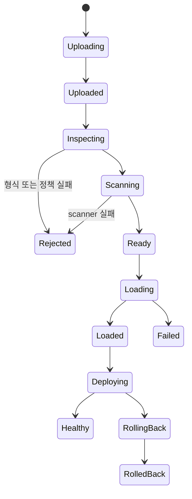

# 업로드와 배포 지시서

## 1. artifact 유형

"tar 등 여러 타입"을 같은 처리로 뭉치지 않고 의미에 따라 구분한다.

| 유형                 | 예시                                       | 처리                                                | 현재                                          |
| -------------------- | ------------------------------------------ | --------------------------------------------------- | --------------------------------------------- |
| Docker image archive | `docker save` 결과 `.tar`, `.tar.gz`(gzip) | Docker image load                                   | **구현**                                      |
| OCI image archive    | OCI layout tar                             | manifest·blob digest 검증 후 load                   | **구현**                                      |
| rootfs archive       | filesystem tar                             | Docker image import, 전문가 권한과 metadata 필수    | 미구현                                        |
| Compose bundle       | manifest + compose + image archives        | 제품 전용 schema 검증 후 복수 리소스 배포           | compose 는 API 본문으로 받는다(아카이브 아님) |
| build context        | Dockerfile이 포함된 tar                    | 격리 BuildKit build, network·secret·cache 정책 제한 | 미구현                                        |

허용 mediaType 은 Docker·OCI image archive 2종뿐이다. 압축은 **gzip 만** 판별하며 bzip2·xz·zstd 는 tar 파싱에 실패해 `ARCHIVE_INVALID` 로 거부된다.

단순 `.zip`을 image archive로 받지 않는다. 압축 형식과 archive semantic을 별도 필드와 server-side sniffing으로 일치시킨다.

## 2. 업로드 계약

- 패널은 multipart 또는 resumable upload session을 사용한다.
- API 클라이언트는 upload 생성, chunk 전송, 완료 순서로 진행한다.
- 모든 업로드는 `Idempotency-Key`와 예상 byte, 예상 SHA-256, artifact type을 받는다.
- server는 chunk별 digest와 최종 digest를 검증한다.
- chunk 상한은 64MiB, 사용자당 동시 upload 는 2개다. 총 quota 는 환경변수 `UPLOAD_TOTAL_QUOTA_BYTES`(기본 32GiB) 하나뿐이고 **사용자별 quota 와 관리 UI 는 미구현이다.**
- Cloudflare Free의 단일 request body 제한보다 chunk를 충분히 작게 유지한다. 단일 10GiB HTTP request는 지원하지 않는다.
- proxy buffering 때문에 disk를 이중 사용하는지 측정하고 대용량 upload route는 명시적으로 tuning한다.
- 진행률은 durable job event 로 남기고 화면이 폴링해 읽는다. SSE 재생(`Last-Event-ID`)은 미구현이다.

## 3. 상태 기계

**위 다이어그램은 초기 구상이다.** 실제로 저장되는 상태는 둘로 나뉜다.

- `upload_session.status`: `uploading` → `completed` 또는 `rejected`. digest 불일치와 아카이브 검사 실패가 `rejected` 다(활성 슬롯을 놓는다). `Uploaded`·`Inspecting`·`Scanning`·`Ready` 라는 상태는 없다.
- `deployment.status`(이미지 load 이력): `loading` → `loaded` 또는 `failed`. `artifact.status` 는 `ready` 고정이다.

취소는 상태가 아니라 클라이언트의 요청 중단이다. 서버 세션은 남고 같은 파일을 다시 올리면 이어진다(§업로드 재개와 취소).

## 4. quarantine 검사

1. 서버 생성 ID 경로로 스트리밍 저장한다.
2. 선언 크기와 실제 크기, SHA-256을 비교한다.
3. magic bytes와 압축 형식을 식별한다.
4. archive header를 streaming scan한다.
5. 파일 수, 총 uncompressed byte, compression ratio, depth를 제한한다.
6. absolute path, `..`, NUL, device node, FIFO, escaping symlink·hardlink를 거부한다.
7. Docker 또는 OCI manifest와 referenced layer 존재·digest를 검증한다.
8. 성공 artifact만 immutable ready 영역으로 이동한다.

**8~10 의 scanner 단계(악성 파일·취약점·secret 검사, 예외 승인자 저장)와 platform 검증은 미구현이다.** 아래 취약점 정책 문단도 아직 코드가 없다.

검사에 실패하면 세션을 `rejected` 로 전이해 활성 슬롯을 놓고, 임시 파일은 TTL 정리가 지운다. 원본 파일명을 filesystem 경로에 사용하지 않는다.

(구상) critical vulnerability는 기본 차단한다. owner 예외에는 finding, 사유, 승인자, 만료, 적용 deployment를 기록하고 예외 만료 후 재배포를 막는다. `linux/arm64`를 기본 platform으로 검증하고 `linux/amd64`는 Docker Desktop emulation 가용성 검사 후 허용한다.

## 5. 배포 manifest

- deployment name과 version
- image digest
- container name 정책
- command, entrypoint, environment key 목록
- secret reference 목록
- internal port와 protocol
- CPU, memory, pids 제한
- restart policy
- healthcheck
- managed named volume
- managed network
- Nginx hostname·path route
- rollout strategy
- rollback 대상

환경변수 값과 secret 값은 manifest DB row나 audit에 평문 저장하지 않는다. secret 값은 별도 `deployment_secret` 저장소에서 AES-256-GCM으로 암호화하고 manifest는 reference만 사용한다.

## 6. rollout

### 6.1 권장 blue-green

1. artifact를 load하고 digest를 고정한다.
2. 새 version container를 고유 이름으로 생성한다.
3. 관리 network에만 연결하고 외부 route는 아직 연결하지 않는다.
4. healthcheck와 smoke request를 통과시킨다.
5. 새 Nginx revision을 생성·검증한다.
6. route를 새 upstream으로 graceful reload한다.
7. 관찰 window 동안 오류율·health를 확인한다.
8. 성공하면 이전 container를 stop하고 rollback window 동안 보존한다.
9. window 종료 후 정책에 따라 이전 container·image를 정리한다.

### 6.2 실패 처리

- create 이전 실패: artifact 상태만 실패로 기록한다.
- health 실패: 신규 container log·inspect를 보존하고 route를 바꾸지 않는다. 보존 형태는 durable job event `detail`(`step: 'failure-diagnostics'`)이며 exit code·container error·리댁션한 로그 20줄을 담는다. 패널은 배포 화면의 실패 릴리스에서 이를 펼쳐 볼 수 있고, 조회 권한은 job event 와 같다(세션 owner·admin, API key `job:read`).
- Nginx 적용 실패: 기존 route가 유지되어야 한다.
- 적용 후 관찰 실패: 이전 Nginx revision을 복원하고 신규 container를 격리한다.
- cleanup 실패: 배포 성공과 cleanup warning을 구분하고 재시도 job을 만든다.

## 7. 패널 흐름

- upload dropzone과 파일 선택
- artifact type, expected platform, checksum 표시
- 단계별 진행과 scanner 결과
- image metadata와 배포 form
- route와 resource 영향 미리보기
- 배포 job timeline
- health·logs·events 연결
- rollback 버튼과 대상 version 비교

업로드 페이지를 벗어나도 job은 계속되고 전역 job center에서 다시 열 수 있어야 한다.

## 8. API 흐름

- `POST /api/uploads/sessions` — upload session 생성(`Idempotency-Key` 헤더 필수)
- `PUT /api/uploads/sessions/:sessionId/chunks?offset=` — 순차 chunk, `x-chunk-sha256` 헤더
- `POST /api/uploads/sessions/:sessionId/finalize` — digest 확인과 검사 job 시작(202 + job)
- `GET|POST /api/deployment-manifests` — 불변 manifest 목록·생성
- `POST /api/deployment-manifests/:id/releases` — blue-green release 시작
- `GET /api/deployment-releases/:id` — release 상태 조회
- `GET /api/jobs/:id/events` — durable job event **목록 조회(JSON 폴링)**. SSE 재생은 미구현이다
- `POST /api/deployment-releases/:id/rollback` — 이전 정상 version으로 전환
- `DELETE /api/artifacts/:artifactId` — artifact 폐기(confirmation 은 artifact id). load 가 진행 중이면(`deployment.status='loading'`) 409 `ARTIFACT_IN_USE`, 끝난 뒤라면 load 이력 행은 남기고 `deployment.artifact_id` 를 null 로 만든 뒤 파일을 회수한다
- `DELETE /api/deployment-manifests/:id` — manifest 폐기(릴리스나 스택이 참조 중이면 409 `DEPLOYMENT_MANIFEST_IN_USE`)
- `DELETE /api/deployment-stacks/:id` — 스택 폐기(진행 중인 릴리스가 있으면 409 `DEPLOYMENT_STACK_IN_USE`, 없으면 스택 릴리스 이력까지 함께 지운다. manifest 는 남는다)

세션 조회(`GET /api/uploads/:id`)와 세션 폐기 엔드포인트는 없다.

Hono RPC는 JSON control endpoint 타입을 제공한다. 대용량 binary chunk와 SSE·WebSocket은 별도 typed wrapper를 사용하되 같은 Zod DTO와 인증 정책을 공유한다.

## 9. 정리와 quota

- 전체 upload byte quota(사용자별은 미구현)
- ready artifact 보존 기간
- 실패 artifact 짧은 보존
- load 가 진행 중인 artifact·참조 중인 image 삭제 금지. load 가 끝난 artifact 는 이력을 남긴 채 회수 대상이다
- disk soft watermark에서 새 upload 경고
- hard watermark에서 새 upload·build 차단
- orphan chunk와 interrupted upload 주기 정리
- cleanup도 audit와 metrics 대상
- volume available bytes, Engine reclaimable bytes와 예약 job bytes를 함께 표시(운영자가 입력한 디스크 구성값을 저장하는 기능은 미구현)

## 10. 현재 구현 기준선

- immutable `deployment_manifest`는 name/version, 고정 image digest, resource, health, route, rollout, volume, environment key와 secret reference만 저장한다.
- secret 값과 일반 환경변수 값은 manifest와 audit에 저장하지 않는다. secret은 `/data`의 별도 master key로 AES-256-GCM 암호화하며 metadata·reference·version만 API와 SSR에 노출한다.
- 같은 reference를 다시 저장하면 rotation version이 증가한다. release 시작과 실행 직전에 최신 reference를 확인하며, 참조 중인 secret 삭제를 거부한다.
- 일반 `environmentKeys`는 값 저장 정책이 없으므로 release를 계속 거부하고, secret binding만 Docker environment로 전달한다. container inspect는 값 없이 key만 반환한다.
- release는 `creating → probing → switching → observing → healthy` 상태를 저장하며 실패 시 `failed` 또는 `rolled-back`으로 종료한다. 수동 롤백은 `rolling-back` 을 경유한다.
- 신규 container는 **`containers_probe`**(환경변수 `PROBE_NETWORK_NAME`)에서 생성되고, health probe 전에 목표 network 를 먼저 연결한다 — probe 단계에서도 다른 network 의 의존(DB 등)을 DNS 로 찾을 수 있어야 하기 때문이다([bug](./bug/2026-08-20-probe-network-blocks-db-dependent-releases.md)). 공개 라우트가 있으면 probe 통과 후 probe network 에서 분리하고, **라우트가 없는 내부 서비스(`route: null`)는 관찰 probe 까지 마친 뒤 분리한다** — engine-agent 가 관찰 probe 를 보내려면 probe network 가 필요하기 때문이다([bug](./bug/2026-08-06-internal-service-observation-unreachable.md)).
- 내부 서비스는 nginx upsert·라우트 probe·라우트 관찰을 모두 건너뛰고 컨테이너 probe 로 관찰한다.
- 구조화 Nginx route는 apply 성공 뒤에만 DB target을 갱신한다. reload 직후 이전 worker 응답은 health retry 정책으로 흡수한다.
- route observation 실패는 이전 healthy release로 route를 복원한다. 이전 release가 없으면 새 route를 제거하고 신규 container를 중지한다.
- API는 release 생성과 수동 rollback 시작에 `202 { release, job }`을 반환하고 상태 조회를 제공한다. 진행 상태는 SQLite에 기록하며 API 재시작 시 중단된 create·probe·route switch·observation·rollback을 안전한 종료 상태로 수렴시킨다.
- 수동 rollback은 이전 container를 control network에서 재기동·검증하고 Nginx route probe 성공 뒤 현재 container를 중지한다. 실패하면 현재 정상 route를 복원한다.
- 이전 container는 새 manifest의 rollback retention 동안 보존하며, 만료 cleanup은 시작 시와 1시간 주기로 재시도하고 named volume은 삭제하지 않는다.
- Next.js SSR dashboard는 manifest·release 초기 상태, 생성 form, release polling, rollback action을 한국어·영어·일본어로 제공한다.
- upload session은 ready artifact와 활성 예약량의 합계를 총 quota와 비교한다. Docker Desktop 실제 available bytes에서 아직 전송되지 않은 예약량까지 빼고 soft watermark는 UI 경고, hard watermark는 HTTP 507로 차단하며 각 chunk 직전 다시 확인한다.
- 기본값은 총 300GiB, soft available 32GiB, hard available 16GiB이며 세 값 모두 환경변수로 조정한다.
- artifact load, upload finalize, release 실행, 수동 rollback은 `operation_job` durable queue로 실행한다. job kind는 `deploy.load`, `upload.finalize`, `deploy.release`, `deploy.rollback`이며 실행 상태와 실패 코드는 job timeline에 남는다.
- 각 job은 `resource_key`(artifactId·sessionId·releaseId)로 잠근다. 같은 리소스의 active job이 있으면 새 job을 만들지 않고 기존 job을 반환한다.
- `POST /api/artifacts/:artifactId/load`는 이미 `loaded` 상태 deployment 행이 있으면 job 없이 `200 { deployment }`를, 없으면 `202 { job }`을 반환한다. `POST /api/uploads/sessions/:sessionId/finalize`는 session 존재와 actor 소유를 동기 검증한 뒤 `202 { job }`을 반환하고, 같은 내용(sha256)의 artifact가 이미 있으면 그 artifact를 멱등 반환한다.
- release·rollback job은 재시도하지 않는다(`maxAttempts` 1). 상태 머신이 시도를 이미 소비했으므로 중단된 실행 정리는 release reconcile이 담당한다.
- 단계 중간부터 이어 실행하는 세분화된 재개는 후속 범위다.

## 배포 manifest 의 런타임 (2026-08-05)

manifest 에 `runtime` 블록이 있다(`profile`·`capabilities`·`writablePaths`). 기본 `standard` 는 Docker 기본 capability 집합과 쓰기 가능한 루트라 **순정 이미지가 그대로 뜬다.** 이전에는 읽기 전용 루트와 `CapDrop: ALL` 이 하드코딩돼 공식 이미지 대부분이 기동조차 못 했다.

이미 저장된 manifest 는 migration `0018_manifest_runtime` 의 기본값 `hardened` 로 남아 동작이 바뀌지 않는다. 상세는 [acknowledge/0037](./acknowledge/0037-container-runtime-profile.md).

**아티팩트는 이미지 아카이브만 받는다.** 정적 파일을 올려 호스트 경로로 마운트하는 방식은 열지 않는다 — 호스트 bind mount 는 컨테이너 탈출 경로이기 때문이다. 정적 파일은 이미지에 구워 올린다.

## compose 스택 (2026-08-06)

§1 표의 "Compose bundle" 은 초기 구상이다. **실제 구현은 compose 파일을 아티팩트로 올리지 않는다.** 이미지는 기존 업로드 경로로 먼저 올려 두고, compose 원문은 API 본문(텍스트, 256KiB 상한)으로 보낸다.

| 엔드포인트                            | 하는 일                                                                     |
| ------------------------------------- | --------------------------------------------------------------------------- |
| `POST /api/deployment-stacks/preview` | 변환 결과·의존 순서·무시한 키를 돌려준다. **아무것도 저장하지 않는다**      |
| `POST /api/deployment-stacks`         | 같은 변환을 수행하고 스택 1건 + manifest N건을 **한 트랜잭션**으로 저장한다 |

- 이미지 태그는 로컬 이미지의 config digest 로 해석한다. 태그→digest 맵은 **스택당 `getImages()` 1회**로 만들고, 태그·`:latest` 생략형·`repo@sha256:` 참조를 키로 넣는다. 맵에 없는 태그는 `DEPLOYMENT_IMAGE_DIGEST_NOT_FOUND` 다.
- manifest 이름은 `<스택>-<서비스>` 이고 버전은 스택 버전을 그대로 쓴다. 같은 이름·버전 manifest 가 이미 있으면 저장하지 않고 409 다.
- 저장은 `deployment_stack.manifestIdsJson` 을 `serviceOrderJson` 과 같은 순서로 남긴다. 3.3 의 순차 배포·역순 롤백이 이 순서를 쓴다.
- compose 원문은 보관하지 않는다. 저장 정본은 변환된 manifest 다 → [acknowledge/0041](./acknowledge/0041-deployment-stack-persistence.md).
- 거부 규칙과 label 계약은 [acknowledge/0040](./acknowledge/0040-compose-stack-contract.md) 이 정본이다.

### 스택 배포와 되돌리기

`POST /api/deployment-stacks/:stackId/releases` 는 `deploy.stack-release` job 을 넣고 202 로 `{ job, stackRelease }` 를 준다. job 이 `deployment_stack_release` 를 실행한다.

- 순서는 스택의 `serviceOrder`(= compose `depends_on` 위상 정렬)다. 서비스마다 기존 blue-green 릴리스를 그대로 쓴다 — 새 계약을 만들지 않았다.
- 실패하면 **이미 healthy 인 서비스를 역순으로 되돌린다.** 이전 버전이 있으면 `prepareRollback` + `runRollback` 으로 이전 컨테이너를 다시 띄우고, 첫 배포라 이전 버전이 없으면 `revert` 로 라우트를 지우고 컨테이너를 멈춘다(`failureCode=RELEASE_REVERTED`).
- 실패한 서비스 자신은 릴리스 서비스가 이미 정리했으므로 스택은 그 앞의 것들만 되돌린다.
- 되돌리기까지 실패하면 스택 배포는 `rolled-back` 이 아니라 `failed` 다. 손이 필요한 상태라는 뜻이다.
- 동시성은 두 겹이다. `deployment_stack_release` 의 부분 unique index(`status='releasing'`)와 서비스의 사전 검사가 같은 스택의 두 번째 배포를 409 로 막는다.
- API 재기동 시 `releasing` 으로 남은 스택 배포는 `DEPLOYMENT_STACK_RELEASE_INTERRUPTED` 로 `failed` 처리한다. 개별 릴리스는 기존 `reconcileInterrupted` 가 따로 수렴시킨다.

## 업로드 재개와 취소 (2026-08-06)

서버는 처음부터 재개를 전제로 설계돼 있었다(`OFFSET_MISMATCH`, actor+idempotency-key 로 세션 재사용). 클라이언트가 매번 새 UUID 를 만들고 offset 0 부터 보내 그 전제를 쓰지 못했다.

- **idempotency-key 는 파일 sha256** 이다. 같은 파일을 다시 올리면 서버가 같은 세션을 돌려준다.
- 세션이 `uploading` 이면 `receivedBytes` 부터 이어 올린다. 이미 완료된 세션이면 청크 전송을 건너뛰고 finalize 로 간다(서버가 기존 artifact 를 돌려준다).
- 취소는 `AbortController` 다. 진행 중인 요청만 끊고 서버 세션은 남는다 — 그래서 같은 파일을 다시 올리면 이어진다. 방치된 세션은 TTL 만료와 시작 시 정리가 지운다.
- 실측(2026-08-06): 같은 키로 세션을 두 번 만들면 같은 세션 id 를 돌려주고, 4MiB 청크 전송 후 두 번째 응답의 `receivedBytes` 가 4194304 였다.
